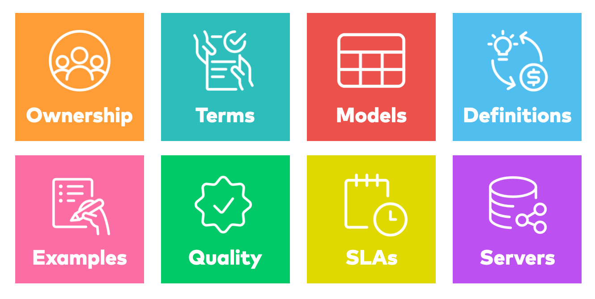

# Data Contract Specification 

<a href="https://github.com/datacontract/datacontract-specification">
    </a>
<a href="https://datacontract.com/slack" rel="nofollow"></a>


Data contracts bring data providers and data consumers together.

A _data contract_ is a document that defines the structure, format, semantics, quality, and terms of use for exchanging data between a data provider and their consumers. 
Think of an API, but for data. 
A data contract is implemented by a data product or other data technologies, even legacy data warehouses. 
Data contracts can also be used for the input port to specify the expectations of data dependencies and verify given guarantees.

The _data contract specification_ defines a YAML format to describe attributes of provided data sets. 
It is data platform neutral and can be used with any data platform, such as AWS S3, Google BigQuery, Azure, Databricks, and Snowflake. 
The data contract specification is an open initiative to define a common data contract format. 
It follows [OpenAPI](https://www.openapis.org/) and [AsyncAPI](https://www.asyncapi.com/) conventions.

Data contracts come into play when data is exchanged between different teams or organizational units, such as in a [data mesh architecture](https://www.datamesh-architecture.com/). 
First, and foremost, data contracts are a communication tool to express a common understanding of how data should be structured and interpreted. 
They make semantic and quality expectations explicit. 
They are often created collaboratively in [workshops](./workshop.md) together with data providers and data consumers. 
Later in development and production, they also serve as the basis for code generation, testing, schema validations, quality checks, monitoring, access control, and computational governance policies.

The specification comes along with the [Data Contract CLI](https://github.com/datacontract/datacontract-cli), an open-source tool to develop, validate, and enforce data contracts.

> _Note: The term "data contract" refers to a specification that is usually owned by the data provider and thus does not align with a "contract" in a legal sense as a mutual agreement between two parties. 
> The term "contract" may be somewhat misleading, but it is how it is used by the industry. 
> The mutual agreement between one data provider and one data consumer is the "data usage agreement" that refers to a data contract. 
> Data usage agreements have a defined lifecycle, start/end date, and help the data provider to track who accesses their data and for which purposes._

Version
---

1.1.0([Changelog](CHANGELOG.md))

Example
---

View in [Data Contract Catalog](https://datacontract.com/examples/index.html)

```yaml
dataContractSpecification: 1.1.0
id: urn:datacontract:checkout:orders-latest
info:
  title: Orders Latest
  version: 1.0.0
  description: |
    Successful customer orders in the webshop. 
    All orders since 2020-01-01. 
    Orders with their line items are in their current state (no history included).
  owner: Checkout Team
  contact:
    name: John Doe (Data Product Owner)
    url: https://teams.microsoft.com/l/channel/example/checkout
servers:
  production:
    type: s3
    environment: prod
    location: s3://datacontract-example-orders-latest/data/{model}/*.json
    format: json
    delimiter: new_line
    description: "One folder per model. One file per day."
    roles:
      - name: analyst_us
        description: Access to the data for US region
      - name: analyst_cn
        description: Access to the data for China region
terms:
  usage: |
    Data can be used for reports, analytics and machine learning use cases.
    Order may be linked and joined by other tables
  limitations: |
    Not suitable for real-time use cases.
    Data may not be used to identify individual customers.
    Max data processing per day: 10 TiB
  policies:
    - name: privacy-policy
      url: https://example.com/privacy-policy
    - name: license
      description: External data is licensed under agreement 1234.
      url: https://example.com/license/1234
  billing: 5000 USD per month
  noticePeriod: P3M
models:
  orders:
    description: One record per order. Includes cancelled and deleted orders.
    type: table
    fields:
      order_id:
        $ref: '#/definitions/order_id'
        required: true
        unique: true
        primaryKey: true
      order_timestamp:
        description: The business timestamp in UTC when the order was successfully registered in the source system and the payment was successful.
        type: timestamp
        required: true
        examples:
          - "2024-09-09T08:30:00Z"
        tags: ["business-timestamp"]
      order_total:
        description: Total amount the smallest monetary unit (e.g., cents).
        type: long
        required: true
        examples:
          - 9999
        quality:
          - type: sql
            description: 95% of all order total values are expected to be between 10 and 499 EUR.
            query: |
              SELECT quantile_cont(order_total, 0.95) AS percentile_95
              FROM orders
            mustBeBetween: [1000, 49900]
      customer_id:
        description: Unique identifier for the customer.
        type: text
        minLength: 10
        maxLength: 20
      customer_email_address:
        description: The email address, as entered by the customer.
        type: text
        format: email
        required: true
        pii: true
        classification: sensitive
        quality:
          - type: text
            description: The email address is not verified and may be invalid.
        lineage:
          inputFields:
            - namespace: com.example.service.checkout
              name: checkout_db.orders
              field: email_address
      processed_timestamp:
        description: The timestamp when the record was processed by the data platform.
        type: timestamp
        required: true
        config:
          jsonType: string
          jsonFormat: date-time
    quality:
      - type: sql
        description: The maximum duration between two orders should be less that 3600 seconds
        query: |
          SELECT MAX(EXTRACT(EPOCH FROM (order_timestamp - LAG(order_timestamp) OVER (ORDER BY order_timestamp)))) AS max_duration
          FROM orders
        mustBeLessThan: 3600
      - type: sql
        description: Row Count
        query: |
          SELECT count(*) as row_count
          FROM orders
        mustBeGreaterThan: 5
    examples:
      - |
        order_id,order_timestamp,order_total,customer_id,customer_email_address,processed_timestamp
        "1001","2030-09-09T08:30:00Z",2500,"1000000001","mary.taylor82@example.com","2030-09-09T08:31:00Z"
        "1002","2030-09-08T15:45:00Z",1800,"1000000002","michael.miller83@example.com","2030-09-09T08:31:00Z"
        "1003","2030-09-07T12:15:00Z",3200,"1000000003","michael.smith5@example.com","2030-09-09T08:31:00Z"
        "1004","2030-09-06T19:20:00Z",1500,"1000000004","elizabeth.moore80@example.com","2030-09-09T08:31:00Z"
        "1005","2030-09-05T10:10:00Z",4200,"1000000004","elizabeth.moore80@example.com","2030-09-09T08:31:00Z"
        "1006","2030-09-04T14:55:00Z",2800,"1000000005","john.davis28@example.com","2030-09-09T08:31:00Z"
        "1007","2030-09-03T21:05:00Z",1900,"1000000006","linda.brown67@example.com","2030-09-09T08:31:00Z"
        "1008","2030-09-02T17:40:00Z",3600,"1000000007","patricia.smith40@example.com","2030-09-09T08:31:00Z"
        "1009","2030-09-01T09:25:00Z",3100,"1000000008","linda.wilson43@example.com","2030-09-09T08:31:00Z"
        "1010","2030-08-31T22:50:00Z",2700,"1000000009","mary.smith98@example.com","2030-09-09T08:31:00Z"
  line_items:
    description: A single article that is part of an order.
    type: table
    fields:
      line_item_id:
        type: text
        description: Primary key of the lines_item_id table
        required: true
      order_id:
        $ref: '#/definitions/order_id'
        references: orders.order_id
      sku:
        description: The purchased article number
        $ref: '#/definitions/sku'
    primaryKey: ["order_id", "line_item_id"]
    examples:
      - |
        line_item_id,order_id,sku
        "LI-1","1001","5901234123457"
        "LI-2","1001","4001234567890"
        "LI-3","1002","5901234123457"
        "LI-4","1002","2001234567893"
        "LI-5","1003","4001234567890"
        "LI-6","1003","5001234567892"
        "LI-7","1004","5901234123457"
        "LI-8","1005","2001234567893"
        "LI-9","1005","5001234567892"
        "LI-10","1005","6001234567891"
definitions:
  order_id:
    title: Order ID
    type: text
    format: uuid
    description: An internal ID that identifies an order in the online shop.
    examples:
      - 243c25e5-a081-43a9-aeab-6d5d5b6cb5e2
    pii: true
    classification: restricted
    tags:
      - orders
  sku:
    title: Stock Keeping Unit
    type: text
    pattern: ^[A-Za-z0-9]{8,14}$
    examples:
      - "96385074"
    description: |
      A Stock Keeping Unit (SKU) is an internal unique identifier for an article. 
      It is typically associated with an article's barcode, such as the EAN/GTIN.
    links:
      wikipedia: https://en.wikipedia.org/wiki/Stock_keeping_unit
    tags:
      - inventory
servicelevels:
  availability:
    description: The server is available during support hours
    percentage: 99.9%
  retention:
    description: Data is retained for one year
    period: P1Y
    unlimited: false
  latency:
    description: Data is available within 25 hours after the order was placed
    threshold: 25h
    sourceTimestampField: orders.order_timestamp
    processedTimestampField: orders.processed_timestamp
  freshness:
    description: The age of the youngest row in a table.
    threshold: 25h
    timestampField: orders.order_timestamp
  frequency:
    description: Data is delivered once a day
    type: batch # or streaming
    interval: daily # for batch, either or cron
    cron: 0 0 * * * # for batch, either or interval
  support:
    description: The data is available during typical business hours at headquarters
    time: 9am to 5pm in EST on business days
    responseTime: 1h
  backup:
    description: Data is backed up once a week, every Sunday at 0:00 UTC.
    interval: weekly
    cron: 0 0 * * 0
    recoveryTime: 24 hours
    recoveryPoint: 1 week
tags:
  - checkout
  - orders
  - s3
links:
  datacontractCli: https://cli.datacontract.com
```

Data Contract CLI
---

The [Data Contract CLI](https://cli.datacontract.com) is a command line tool and Python library to lint, test, import and export data contracts.

Here is short example how to verify that your actual dataset matches the data contract: 

```bash
pip3 install datacontract-cli
datacontract test https://datacontract.com/examples/orders-latest/datacontract.yaml
```

or, if you prefer Docker:
```bash
docker run datacontract/cli test https://datacontract.com/examples/orders-latest/datacontract.yaml
```

The Data Contract contains all required information to verify data: 

- The _servers_ block has the connection details to the actual data set.
- The _models_ define the syntax, formats, and constraints. 
- The _quality_ defined further quality checks.

The Data Contract CLI chooses the appropriate engine, formulates test cases, connects to the server, and executes the tests, based on the server type.

More information and configuration options on [cli.datacontract.com](https://cli.datacontract.com).


Specification
---



- [Data Contract Object](#data-contract-object)
- [Info Object](#info-object)
- [Contact Object](#contact-object)
- [Server Object](#server-object)
- [Terms Object](#terms-object)
- [Model Object](#model-object)
- [Field Object](#field-object)
- [Definition Object](#definition-object)
- [Service Level Object](#service-levels-object)
- [Quality Object](#quality-object)
- [Lineage Object](#lineage-object)
- [Data Types](#data-types)
- [Specification Extensions](#specification-extensions)


[JSON Schema](https://github.com/datacontract/datacontract-specification/blob/main/datacontract.schema.json) of the Data Contract Specification.

### Data Contract Object

This is the root document.

It is _RECOMMENDED_ that the root document be named: `datacontract.yaml`.

| Field                     | Type                                                   | Description                                                                                                          |
|---------------------------|--------------------------------------------------------|----------------------------------------------------------------------------------------------------------------------|
| dataContractSpecification | `string`                                               | REQUIRED. Specifies the Data Contract Specification being used.                                                      |
| id                        | `string`                                               | REQUIRED. An organization-wide unique technical identifier, such as a UUID, URN, slug, string, or number             |
| info                      | [Info Object](#info-object)                            | REQUIRED. Specifies the metadata of the data contract. May be used by tooling.                                       |
| servers                   | Map[`string`, [Server Object](#server-object)]         | Specifies the servers of the data contract.                                                                          |
| terms                     | [Terms Object](#terms-object)                          | Specifies the terms and conditions of the data contract.                                                             |
| models                    | Map[`string`, [Model Object](#model-object)]           | Specifies the logical data model.                                                                                    |
| definitions               | Map[`string`, [Definition Object](#definition-object)] | Specifies definitions.                                                                                               |
| servicelevels             | [Service Levels Object](#service-levels-object)        | Specifies the service level of the provided data                                                                     |
| links                     | Map[`string`, `string`]                                | Additional external documentation links.                                                                             |
| tags                      | Array of `string`                                      | Custom metadata to provide additional context.                                                                       |

This object _MAY_ be extended with [Specification Extensions](#specification-extensions).


### Info Object

Metadata and life cycle information about the data contract.


| Field       | Type                              | Description                                                                                                                                                      |
|-------------|-----------------------------------|------------------------------------------------------------------------------------------------------------------------------------------------------------------|
| title       | `string`                          | REQUIRED. The title of the data contract.                                                                                                                        |
| version     | `string`                          | REQUIRED. The version of the data contract document (which is distinct from the Data Contract Specification version or the Data Product implementation version). |
| status      | `string`                          | The status of the data contract. Can be `proposed`, `in development`, `active`, `deprecated`, `retired`.                                                         |
| description | `string`                          | A description of the data contract.                                                                                                                              |
| owner       | `string`                          | The owner or team responsible for managing the data contract and providing the data.                                                                             |
| contact     | [Contact Object](#contact-object) | Contact information for the data contract.                                                                                                                       |

This object _MAY_ be extended with [Specification Extensions](#specification-extensions).


### Contact Object

Contact information for the data contract.

| Field | Type     | Description                                                                                           |
|-------|----------|-------------------------------------------------------------------------------------------------------|
| name  | `string` | The identifying name of the contact person/organization.                                              |
| url   | `string` | The URL pointing to the contact information. This _MUST_ be in the form of a URL.                     |
| email | `string` | The email address of the contact person/organization. This _MUST_ be in the form of an email address. |

This object _MAY_ be extended with [Specification Extensions](#specification-extensions).

### Server Object

The fields are dependent on the defined type.

| Field       | Type                                               | Description                                                                                                                                                                                                                                                                           |
|-------------|----------------------------------------------------|---------------------------------------------------------------------------------------------------------------------------------------------------------------------------------------------------------------------------------------------------------------------------------------|
| type        | `string`                                           | REQUIRED. The type of the data product technology that implements the data contract. Well-known server types are: `bigquery`, `s3`, `glue`, `redshift`, `azure`, `sqlserver`, `snowflake`, `databricks`, `postgres`, `oracle`, `kafka`, `pubsub`, `sftp`, `kinesis`, `trino`, `local` |
| description | `string`                                           | An optional string describing the server.                                                                                                                                                                                                                                             |
| environment | `string`                                           | An optional string describing the environment, e.g., prod, sit, stg.                                                                                                                                                                                                                  |
| roles       | Array of [Server Role Object](#server-role-object) | An optional array of roles that are available and can be requested to access the server for role-based access control. E.g. separate roles for different regions or sensitive data.                                                                                                   |

This object _MAY_ be extended with [Specification Extensions](#specification-extensions).

#### BigQuery Server Object

| Field   | Type     | Description           |
|---------|----------|-----------------------|
| type    | `string` | `bigquery`            |
| project | `string` | The GCP project name. |
| dataset | `string` |                       |

#### S3 Server Object

| Field       | Type     | Description                                                                                                             |
|-------------|----------|-------------------------------------------------------------------------------------------------------------------------|
| type        | `string` | `s3`                                                                                                                    |
| location    | `string` | S3 URL, starting with `s3://`                                                                                           |
| endpointUrl | `string` | The server endpoint for S3-compatible servers, such as MioIO or Google Cloud Storage, e.g., `https://minio.example.com` |
| format      | `string` | Format of files, such as `parquet`, `delta`, `json`, `csv`                                                              |
| delimiter   | `string` | (Only for format = `json`), how multiple json documents are delimited within one file, e.g., `new_line`, `array`        |

Example (AWS S3):

```yaml
servers:
  production:
    type: s3
    location: s3://acme-orders-prod/orders/
    format: json
    delimiter: new_line
```

Example (MinIO):

```yaml
servers:
  minio:
    type: s3
    endpointUrl: http://localhost:9000
    location: s3://my-bucket/path/
    format: delta
```

Example (Google Cloud Storage):

```yaml
servers:
  gcs:
    type: s3
    endpointUrl: https://storage.googleapis.com
    location: s3://my-bucket/path/*/*/*/*/*.parquet
    format: parquet
```


#### Redshift Server Object

| Field    | Type     | Description |
|----------|----------|-------------|
| type     | `string` | `redshift`  |
| account  | `string` |             |
| database | `string` |             |
| schema   | `string` |             |

#### Azure Server Object

| Field     | Type     | Description                                                                                                                                                                                                                                                                                                              |
|-----------|----------|--------------------------------------------------------------------------------------------------------------------------------------------------------------------------------------------------------------------------------------------------------------------------------------------------------------------------|
| type      | `string` | `azure`                                                                                                                                                                                                                                                                                                                  |
| location  | `string` | Fully qualified path to Azure Blob Storage or Azure Data Lake Storage (ADLS), supports globs. Starting with `az://` or `abfss`<br> Examples: `az://my_storage_account_name.blob.core.windows.net/my_container/path/*.parquet` or `abfss://my_storage_account_name.dfs.core.windows.net/my_container_name/path/*.parquet` |
| format    | `string` | Format of files, such as `parquet`, `json`, `csv`                                                                                                                                                                                                                                                                        |
| delimiter | `string` | (Only for format = `json`), how multiple json documents are delimited within one file, e.g., `new_line`, `array`                                                                                                                                                                                                         |


#### SQL-Server Server Object

| Field    | Type      | Description                                                              |
|----------|-----------|--------------------------------------------------------------------------|
| type     | `string`  | `sqlserver`                                                              |
| host     | `string`  | The host to the database server                                          |
| port     | `integer` | The port to the database server, default: `1433`                         |
| database | `string`  | The name of the database, e.g., `database`.                              |
| schema   | `string`  | The name of the schema in the database, e.g., `dbo`.                     |
| driver   | `string`  | The name of the supported driver, e.g., `ODBC Driver 18 for SQL Server`. |


#### Snowflake Server Object

| Field    | Type     | Description |
|----------|----------|-------------|
| type     | `string` | `snowflake` |
| account  | `string` |             |
| database | `string` |             |
| schema   | `string` |             |

#### Databricks Server Object

| Field   | Type     | Description                                                         |
|---------|----------|---------------------------------------------------------------------|
| type    | `string` | `databricks`                                                        |
| host    | `string` | The Databricks host, e.g., `dbc-abcdefgh-1234.cloud.databricks.com` |
| catalog | `string` | The name of the Hive or Unity catalog                               |
| schema  | `string` | The schema name in the catalog                                      |

#### Postgres Server Object

| Field    | Type      | Description                                             |
|----------|-----------|---------------------------------------------------------|
| type     | `string`  | `postgres`                                              |
| host     | `string`  | The host to the database server                         |
| port     | `integer` | The port to the database server                         |
| database | `string`  | The name of the database, e.g., `postgres`.             |
| schema   | `string`  | The name of the schema in the database, e.g., `public`. |

#### Oracle Server Object

| Field       | Type      | Description                     |
|-------------|-----------|---------------------------------|
| type        | `string`  | `oracle`                        |
| host        | `string`  | The host to the oracle server   |
| port        | `integer` | The port to the oracle server   |
| serviceName | `string`  | The name of the service         |

#### Kafka Server Object

| Field  | Type     | Description                                                               |
|--------|----------|---------------------------------------------------------------------------|
| type   | `string` | `kafka`                                                                   |
| host   | `string` | The bootstrap server of the kafka cluster.                                |
| topic  | `string` | The topic name.                                                           |
| format | `string` | The format of the message. Examples: json, avro, protobuf. Default: json. |

#### Pub/Sub Server Object

| Field   | Type     | Description           |
|---------|----------|-----------------------|
| type    | `string` | `pubsub`              |
| project | `string` | The GCP project name. |
| topic   | `string` | The topic name.       |

#### sftp Server Object

| Field     | Type     | Description                                                                                                      |
|-----------|----------|------------------------------------------------------------------------------------------------------------------|
| type      | `string` | `sftp`                                                                                                           |
| location  | `string` | S3 URL, starting with `sftp://`                                                                                  |
| format    | `string` | Format of files, such as `parquet`, `delta`, `json`, `csv`                                                       |
| delimiter | `string` | (Only for format = `json`), how multiple json documents are delimited within one file, e.g., `new_line`, `array` |

#### AWS Kinesis Data Streams Server Object

| Field  | Type     | Description                                                               |
|--------|----------|---------------------------------------------------------------------------|
| type   | `string` | `kinesis`                                                                 |
| stream | `string` | The name of the Kinesis data stream.                                      |
| region | `string` | AWS region, e.g., `eu-west-1`.                                            |
| format | `string` | The format of the records. Examples: json, avro, protobuf.                |

#### Trino Server Object

| Field    | Type      | Description                                               |
|----------|-----------|-----------------------------------------------------------|
| type     | `string`  | `trino`                                                   |
| host     | `string`  | The Trino host                                            |
| port     | `integer` | The Trino port                                            | 
| catalog  | `string`  | The name of the catalog, e.g., `my_catalog`.              |
| schema   | `string`  | The name of the schema in the catalog, e.g., `my_schema`. |

#### Local Server Object

| Field  | Type     | Description                                                                         |
|--------|----------|-------------------------------------------------------------------------------------|
| type   | `string` | `local`                                                                             |
| path   | `string` | The relative or absolute path to the data file(s), such as `./folder/data.parquet`. |
| format | `string` | The format of the file(s), such as `parquet`, `delta`, `csv`, or `json`.            |

#### Server Role Object

| Field       | Type     | Description                                                  |
|-------------|----------|--------------------------------------------------------------|
| name        | `string` | Name of the role                                             |
| description | `string` | A description of the role and what access the role provides. |

### Terms Object

The terms and conditions of the data contract.

| Field        | Type                                     | Description                                                                                                                                                                 |
|--------------|------------------------------------------|-----------------------------------------------------------------------------------------------------------------------------------------------------------------------------|
| usage        | `string`                                 | The usage describes the way the data is expected to be used. Can contain business and technical information.                                                                |
| limitations  | `string`                                 | The limitations describe the restrictions on how the data can be used, can be technical or restrictions on what the data may not be used for.                               |
| policies     | Array of [Policy Object](#policy-object) | A list of policies, licenses, standards, that are applicable for this data contract and that must be acknowledged by data consumers.                                        |
| billing      | `string`                                 | The billing describes the pricing model for using the data, such as whether it's free, having a monthly fee, or metered pay-per-use.                                        |
| noticePeriod | `string`                                 | The period of time that must be given by either party to terminate or modify a data usage agreement. Uses ISO-8601 period format, e.g., `P3M` for a period of three months. |

This object _MAY_ be extended with [Specification Extensions](#specification-extensions).

#### Policy Object

| Field       | Type     | Description                       |
|-------------|----------|-----------------------------------|
| name        | `string` | Name of the policy.               |
| description | `string` | A description of the policy.      |
| url         | `string` | An URL that refers to the policy. |


### Model Object

The Model Object describes the structure and semantics of a data model, such as tables, views, or structured files.

The name of the data model (table name) is defined by the key that refers to this Model Object.

| Field       | Type                                         | Description                                                                                                                          |
|-------------|----------------------------------------------|--------------------------------------------------------------------------------------------------------------------------------------|
| type        | `string`                                     | The type of the model. Examples: `table`, `view`, `object`. Default: `table`.                                                        |
| description | `string`                                     | An optional string describing the data model.                                                                                        |
| title       | `string`                                     | An optional string for the title of the data model. Especially useful if the name of the model is cryptic or contains abbreviations. |
| fields      | Map[`string`, [Field Object](#field-object)] | The fields (e.g. columns) of the data model.                                                                                         |
| primaryKey  | Array of `string`                            | If the primary key is a compound key, list the field names that constitute the primary key. Alternative to field-level `primaryKey`. |
| quality     | Array of [Quality Object](#quality-object)   | Specifies the quality attributes on model level.                                                                                     |
| examples    | Array of `Any`                               | Specifies example data sets for the model.                                                                                           |
| config      | [Config Object](#config-object)              | Any additional key-value pairs that might be useful for further tooling.                                                             |


This object _MAY_ be extended with [Specification Extensions](#specification-extensions).


### Field Object

The Field Objects describes one field (column, property, nested field) of a data model.

| Field            | Type                                         | Description                                                                                                                                                                                                                                                                                                                                                                                                                  |
|------------------|----------------------------------------------|------------------------------------------------------------------------------------------------------------------------------------------------------------------------------------------------------------------------------------------------------------------------------------------------------------------------------------------------------------------------------------------------------------------------------|
| description      | `string`                                     | An optional string describing the semantic of the data in this field.                                                                                                                                                                                                                                                                                                                                                        |
| type             | [Data Type](#data-types)                     | The logical data type of the field.                                                                                                                                                                                                                                                                                                                                                                                          |
| title            | `string`                                     | An optional string providing a human readable name for the field. Especially useful if the field name is cryptic or contains abbreviations.                                                                                                                                                                                                                                                                                  |
| enum             | array of `string`                            | A value must be equal to one of the elements in this array value. Only evaluated if the value is not null.                                                                                                                                                                                                                                                                                                                   |
| required         | `boolean`                                    | An indication, if this field must contain a value and may not be null. Default: `false`                                                                                                                                                                                                                                                                                                                                      |
| primaryKey       | `boolean`                                    | If this field is a primary key. Default: `false`                                                                                                                                                                                                                                                                                                                                                                             |
| references       | `string`                                     | The reference to a field in another model. E.g. use 'orders.order_id' to reference the order_id field of the model orders. Think of defining a foreign key relationship.                                                                                                                                                                                                                                                     |
| unique           | `boolean`                                    | An indication, if the value must be unique within the model. Default: `false`                                                                                                                                                                                                                                                                                                                                                |
| format           | `string`                                     | `email`: A value must be complaint to [RFC 5321, section 4.1.2](https://www.rfc-editor.org/info/rfc5321).<br>`uri`: A value must be complaint to [RFC 3986](https://www.rfc-editor.org/info/rfc3986).<br>`uuid`: A value must be complaint to [RFC 4122](https://www.rfc-editor.org/info/rfc4122). Only evaluated if the value is not null. Only applies to unicode character sequences types (`string`, `text`, `varchar`). |
| precision        | `number`                                     | The maximum number of digits in a number. Only applies to numeric values. Defaults to 38.                                                                                                                                                                                                                                                                                                                                    |
| scale            | `number`                                     | The maximum number of decimal places in a number. Only applies to numeric values. Defaults to 0.                                                                                                                                                                                                                                                                                                                             |
| minLength        | `number`                                     | A value must greater than, or equal to, the value of this. Only evaluated if the value is not null. Only applies to unicode character sequences types (`string`, `text`, `varchar`).                                                                                                                                                                                                                                         |
| maxLength        | `number`                                     | A value must less than, or equal to, the value of this. Only evaluated if the value is not null. Only applies to unicode character sequences types (`string`, `text`, `varchar`).                                                                                                                                                                                                                                            |
| pattern          | `string`                                     | A value must be valid according to the [ECMA-262](https://262.ecma-international.org/5.1/) regular expression dialect. Only evaluated if the value is not null. Only applies to unicode character sequences types (`string`, `text`, `varchar`).                                                                                                                                                                             |
| minimum          | `number`                                     | A value of a number must greater than, or equal to, the value of this. Only evaluated if the value is not null. Only applies to numeric values.                                                                                                                                                                                                                                                                              |
| exclusiveMinimum | `number`                                     | A value of a number must greater than the value of this. Only evaluated if the value is not null. Only applies to numeric values.                                                                                                                                                                                                                                                                                            |
| maximum          | `number`                                     | A value of a number must less than, or equal to, the value of this. Only evaluated if the value is not null. Only applies to numeric values.                                                                                                                                                                                                                                                                                 |
| exclusiveMaximum | `number`                                     | A value of a number must less than the value of this. Only evaluated if the value is not null. Only applies to numeric values.                                                                                                                                                                                                                                                                                               |
| ~~example~~      | `string`                                     | DEPRECATED, use examples. An example value.                                                                                                                                                                                                                                                                                                                                                                                  |
| examples         | Array of Any                                 | A list of example values.                                                                                                                                                                                                                                                                                                                                                                                                    |
| pii              | `boolean`                                    | An indication, if this field contains Personal Identifiable Information (PII).                                                                                                                                                                                                                                                                                                                                               | 
| classification   | `string`                                     | The data class defining the sensitivity level for this field, according to the organization's classification scheme. Examples may be: `sensitive`, `restricted`, `internal`, `public`.                                                                                                                                                                                                                                       |
| tags             | Array of `string`                            | Custom metadata to provide additional context.                                                                                                                                                                                                                                                                                                                                                                               |
| links            | Map[`string`,`string`]                       | Additional external documentation links.                                                                                                                                                                                                                                                                                                                                                                                     |
| $ref             | `string`                                     | A reference URI to a definition in the specification, internally or externally. Properties will be inherited from the definition.                                                                                                                                                                                                                                                                                            |
| fields           | Map[`string`, [Field Object](#field-object)] | The nested fields (e.g. columns) of the object, record, or struct. Use only when type is `object`, `record`, or `struct`.                                                                                                                                                                                                                                                                                                    |
| items            | [Field Object](#field-object)                | The type of the elements in the array. Use only when type is `array`.                                                                                                                                                                                                                                                                                                                                                        |
| keys             | [Field Object](#field-object)                | Describes the key structure of a map. Defaults to `type: string` if a map is defined as type. Not all server types support different key types. Use only when type is `map`.                                                                                                                                                                                                                                                 |
| values           | [Field Object](#field-object)                | Describes the value structure of a map. Use only when type is `map`.                                                                                                                                                                                                                                                                                                                                                         |
| quality          | Array of [Quality Object](#quality-object)   | Specifies the quality attributes on field level.                                                                                                                                                                                                                                                                                                                                                                             |
| lineage          | [Lineage Object](#lineage-object)            | Provides information where the data comes from.                                                                                                                                                                                                                                                                                                                                                                              |
| config           | [Config Object](#config-object)              | Any additional key-value pairs that might be useful for further tooling.                                                                                                                                                                                                                                                                                                                                                     |

This object _MAY_ be extended with [Specification Extensions](#specification-extensions).


### Definition Object

The Definition Object includes a clear and concise explanations of syntax, semantic, and classification of a business object in a given domain.
It serves as a reference for a common understanding of terminology, ensure consistent usage and to identify join-able fields.
Models fields can refer to definitions using the `$ref` field to link to existing definitions and avoid duplicate documentations.

| Field            | Type                                         | Description                                                                                                                                                                                                                                                                                                                                                                                                                  |
|------------------|----------------------------------------------|------------------------------------------------------------------------------------------------------------------------------------------------------------------------------------------------------------------------------------------------------------------------------------------------------------------------------------------------------------------------------------------------------------------------------|
| type             | [Data Type](#data-types)                     | REQUIRED. The logical data type                                                                                                                                                                                                                                                                                                                                                                                              |
| title            | `string`                                     | The business name of this definition.                                                                                                                                                                                                                                                                                                                                                                                        |
| description      | `string`                                     | Clear and concise explanations related to the domain                                                                                                                                                                                                                                                                                                                                                                         |
| enum             | array of `string`                            | A value must be equal to one of the elements in this array value. Only evaluated if the value is not null.                                                                                                                                                                                                                                                                                                                   |
| format           | `string`                                     | `email`: A value must be complaint to [RFC 5321, section 4.1.2](https://www.rfc-editor.org/info/rfc5321).<br>`uri`: A value must be complaint to [RFC 3986](https://www.rfc-editor.org/info/rfc3986).<br>`uuid`: A value must be complaint to [RFC 4122](https://www.rfc-editor.org/info/rfc4122). Only evaluated if the value is not null. Only applies to unicode character sequences types (`string`, `text`, `varchar`). |
| precision        | `number`                                     | The maximum number of digits in a number. Only applies to numeric values. Defaults to 38.                                                                                                                                                                                                                                                                                                                                    |
| scale            | `number`                                     | The maximum number of decimal places in a number. Only applies to numeric values. Defaults to 0.                                                                                                                                                                                                                                                                                                                             |
| minLength        | `number`                                     | A value must greater than, or equal to, the value of this. Only evaluated if the value is not null. Only applies to unicode character sequences types (`string`, `text`, `varchar`).                                                                                                                                                                                                                                         |
| maxLength        | `number`                                     | A value must less than, or equal to, the value of this. Only evaluated if the value is not null. Only applies to unicode character sequences types (`string`, `text`, `varchar`).                                                                                                                                                                                                                                            |
| pattern          | `string`                                     | A value must be valid according to the [ECMA-262](https://262.ecma-international.org/5.1/) regular expression dialect. Only evaluated if the value is not null. Only applies to unicode character sequences types (`string`, `text`, `varchar`).                                                                                                                                                                             |
| minimum          | `number`                                     | A value of a number must greater than, or equal to, the value of this. Only evaluated if the value is not null. Only applies to numeric values.                                                                                                                                                                                                                                                                              |
| exclusiveMinimum | `number`                                     | A value of a number must greater than the value of this. Only evaluated if the value is not null. Only applies to numeric values.                                                                                                                                                                                                                                                                                            |
| maximum          | `number`                                     | A value of a number must less than, or equal to, the value of this. Only evaluated if the value is not null. Only applies to numeric values.                                                                                                                                                                                                                                                                                 |
| exclusiveMaximum | `number`                                     | A value of a number must less than the value of this. Only evaluated if the value is not null. Only applies to numeric values.                                                                                                                                                                                                                                                                                               |
| examples         | Array of Any                                 | A list of example values.                                                                                                                                                                                                                                                                                                                                                                                                    |
| pii              | `boolean`                                    | An indication, if this field contains Personal Identifiable Information (PII).                                                                                                                                                                                                                                                                                                                                               |
| classification   | `string`                                     | The data class defining the sensitivity level for this field, according to the organization's classification scheme.                                                                                                                                                                                                                                                                                                         |
| tags             | Array of `string`                            | Custom metadata to provide additional context.                                                                                                                                                                                                                                                                                                                                                                               |
| links            | Map[`string`, `string`]                      | Additional external documentation links.                                                                                                                                                                                                                                                                                                                                                                                     |
| fields           | Map[`string`, [Field Object](#field-object)] | The nested fields (e.g. columns) of the object, record, or struct. Use only when type is `object`, `record`, or `struct`.                                                                                                                                                                                                                                                                                                    |
| items            | [Field Object](#field-object)                | The type of the elements in the array. Use only when type is `array`.                                                                                                                                                                                                                                                                                                                                                        |
| keys             | [Field Object](#field-object)                | Describes the key structure of a map. Defaults to `type: string` if a map is defined as type. Not all server types support different key types. Use only when type is `map`.                                                                                                                                                                                                                                                 |
| values           | [Field Object](#field-object)                | Describes the value structure of a map. Use only when type is `map`.                                                                                                                                                                                                                                                                                                                                                         |

This object _MAY_ be extended with [Specification Extensions](#specification-extensions).


### Service Levels Object

A service level is defined as an agreed-upon, measurable level of performance for provided the data.
Data Contract Specification defines well-known service levels. 
This list can be extended with custom service levels.

One can either describe each service level informally using the `description` field, or make use of the predefined fields for automation support, e.g., via the [Data Contract CLI](https://cli.datacontract.com).

| Field        | Type                                          | Description                                                             |
|--------------|-----------------------------------------------|-------------------------------------------------------------------------|
| availability | [Availability Object](#availability-object)   | The promised uptime of the system that provides the data                |
| retention    | [Retention Object](#retention-object)         | The period how long data will be available.                             |
| latency      | [Latency Object](#latency-object)             | The maximum amount of time from the the source to its destination. |
| freshness    | [Freshness Object](#freshness-object)         | The maximum age of the youngest entry.                                  |
| frequency    | [Frequency Object](#frequency-object)         | The update frequency.                                                   |
| support      | [Support Object](#support-object)             | The times when support is provided.                                     |
| backup       | [Backup Object](#backup-object)               | The details about data backup procedures.                               |

This object _MAY_ be extended with [Specification Extensions](#specification-extensions).

#### Availability Object

Availability refers to the promise or guarantee by the service provider about the uptime of the system that provides the data.

| Field       | Type     | Description                                                                    |
|-------------|----------|--------------------------------------------------------------------------------|
| description | `string` | An optional string describing the availability service level.                  |
| percentage  | `string` | An optional string describing the guaranteed uptime in percent (e.g., `99.9%`) |

This object _MAY_ be extended with [Specification Extensions](#specification-extensions).

#### Retention Object

Retention covers the period how long data will be available.

| Field          | Type      | Description                                                                                                                                             |
|----------------|-----------|---------------------------------------------------------------------------------------------------------------------------------------------------------|
| description    | `string`  | An optional string describing the retention service level.                                                                                              |
| period         | `string`  | An optional period of time, how long data is available. Supported formats: Simple duration (e.g., `1 year`, `30d`) and ISO 8601 duration (e.g, `P1Y`).  |
| unlimited      | `boolean` | An optional indicator that data is kept forever.                                                                                                        |
| timestampField | `string`  | An optional reference to the field that contains the timestamp that the period refers to.                                                               |

This object _MAY_ be extended with [Specification Extensions](#specification-extensions).

#### Latency Object

Latency refers to the maximum amount of time from the source to its destination.

Examples are the maximum duration it takes after an order has been recorded in the ecommerce shop until it is available in the orders table in the data analytics platform. This includes the waiting times until the next batch run is started and the processing time of the pipeline.

| Field                   | Type     | Description                                                                                                                                                                              |
|-------------------------|----------|------------------------------------------------------------------------------------------------------------------------------------------------------------------------------------------|
| description             | `string` | An optional string describing the latency service level.                                                                                                                                 |
| threshold               | `string` | An optional maximum duration between the source timestamp and the processed timestamp. Supported formats: Simple duration (e.g., `24 hours`, `5s`) and ISO 8601 duration (e.g, `PT24H`). |
| sourceTimestampField    | `string` | An optional reference to the field that contains the timestamp when the data was provided at the source.                                                                                 |
| processedTimestampField | `string` | An optional reference to the field that contains the processing timestamp, which denotes when the data is made available to consumers of this data contract.                             |

This object _MAY_ be extended with [Specification Extensions](#specification-extensions).

#### Freshness Object

Freshness refers to the maximum age of the youngest entry.

| Field                   | Type     | Description                                                                                                                                      |
|-------------------------|----------|--------------------------------------------------------------------------------------------------------------------------------------------------|
| description             | `string` | An optional string describing the freshness service level.                                                                                       |
| threshold               | `string` | An optional maximum age of the youngest entry. Supported formats: Simple duration (e.g., `24 hours`, `5s`) and ISO 8601 duration (e.g, `PT24H`). |
| timestampField          | `string` | An optional reference to the field that contains the timestamp that the threshold refers to.                                                     |

This object _MAY_ be extended with [Specification Extensions](#specification-extensions).

#### Frequency Object

Frequency describes how often data is updated.

| Field       | Type     | Description                                                                                               |
|-------------|----------|-----------------------------------------------------------------------------------------------------------|
| description | `string` | An optional string describing the frequency service level.                                                |
| type        | `string` | An optional type of data processing. Typical values are `batch`, `micro-batching`, `streaming`, `manual`. |
| interval    | `string` | Optional. Only for batch: How often the pipeline is triggered, e.g., `daily`.                             |
| cron        | `string` | Optional. Only for batch: A cron expression when the pipelines is triggered. E.g., `0 0 * * *`.           |

This object _MAY_ be extended with [Specification Extensions](#specification-extensions).


#### Support Object

Support describes the times when support will be available for contact.

| Field        | Type     | Description                                                                                                                                                                                                                                 |
|--------------|----------|---------------------------------------------------------------------------------------------------------------------------------------------------------------------------------------------------------------------------------------------|
| description  | `string` | An optional string describing the support service level.                                                                                                                                                                                    |
| time         | `string` | An optional string describing the times when support will be available for contact such as `24/7` or `business hours only`.                                                                                                                 |
| responseTime | `string` | An optional string describing the time it takes for the support team to acknowledge a request. This does not mean the issue will be resolved immediately, but it assures users that their request has been received and will be dealt with. |
                                                                                                                                          

This object _MAY_ be extended with [Specification Extensions](#specification-extensions).


#### Backup Object

Backup specifies details about data backup procedures.

| Field         | Type     | Description                                                                                                                                                                                                                                                                                                        |
|---------------|----------|--------------------------------------------------------------------------------------------------------------------------------------------------------------------------------------------------------------------------------------------------------------------------------------------------------------------|
| description   | `string` | An optional string describing the backup service level.                                                                                                                                                                                                                                                            |
| interval      | `string` | An optional interval that defines how often data will be backed up, e.g., `daily`.                                                                                                                                                                                                                                 |
| cron          | `string` | An optional cron expression when data will be backed up, e.g., `0 0 * * *`.                                                                                                                                                                                                                                        |
| recoveryTime  | `string` | An optional Recovery Time Objective (RTO) specifies the maximum amount of time allowed to restore data from a backup after a failure or loss event (e.g., 4 hours, 24 hours).                                                                                                                                      |
| recoveryPoint | `string` | An optional Recovery Point Objective (RPO) defines the maximum acceptable age of files that must be recovered from backup storage for normal operations to resume after a disaster or data loss event. This essentially measures how much data you can afford to lose, measured in time (e.g., 4 hours, 24 hours). |


### Quality Object

The quality object defines quality attributes.

Quality attributes are checks that can be applied to the data to ensure its quality. 
Data can be verified by executing these checks through a data quality engine.

Quality attributes can be:
- A text in natural language that describes the quality of the data.
- An individual SQL query that returns a single value that can be compared.
- Engine-specific types: Pre-defined quality checks, as defined by data quality libraries. Currently, the engines `soda` and `great-expectations` are supported.

A quality object can be specified on field level and on model level. 
The top-level quality object is deprecated.

#### Description Text

A description in natural language that defines the expected quality of the data. 
This is useful to express requirements or expectation when discussing the data contract with stakeholders.
Later in the development process, these might be translated into an executable check (such as `sql`).
It can also be used as a prompt to check the data with an AI engine.

| Field       | Type     | Description                                                        |
|-------------|----------|--------------------------------------------------------------------|
| type        | `string` | `text`                                                   |
| description | `string` | A plain text describing the quality attribute in natural language. |

Example:

```yaml
models:
  my_table:
    fields:
      account_iban:
        quality:
          - type: text
            description: Must be a valid IBAN. Must not be empty.
```

#### SQL

An individual SQL query that returns a single number that can be compared with a threshold. The SQL query must be in the SQL dialect of the provided server.

> __Note:__ Establish a secure development process and use read-only connections, as the misuse of SQL queries can lead to SQL injection attacks.


| Field                      | Type                  | Description                                                                     |
|----------------------------|-----------------------|---------------------------------------------------------------------------------|
| type                       | `string`              | `sql`                                                                           |
| description                | `string`              | A plain text describing the quality of the data.                                |
| query                      | `string`              | A SQL query that returns a single number to compare with the threshold.         |
| mustBe                     | `integer`             | The threshold to check the return value of the query                            |
| mustNotBe                  | `integer`             | The threshold to check the return value of the query                            |
| mustBeGreaterThan          | `integer`             | The threshold to check the return value of the query                            |
| mustBeGreaterThanOrEqualTo | `integer`             | The threshold to check the return value of the query                            |
| mustBeLessThan             | `integer`             | The threshold to check the return value of the query                            |
| mustBeLessThanOrEqualTo    | `integer`             | The threshold to check the return value of the query                            |
| mustBeBetween              | array of two integers | The threshold to check the return value of the query. Boundaries are inclusive. |
| mustNotBeBetween           | array of two integers | The threshold to check the return value of the query. Boundaries are inclusive. |

In the query the following placeholders can be used:

| Placeholder | Description                                                                            |
|-------------|----------------------------------------------------------------------------------------|
| `{model}`  | The name of the model that is checked.                                                 |
| `{table}`  | Alias for `{model}`.                                                                  |
| `{field}`  | The name of the field that is checked (only if the quality is defined on field-level). |
| `{column}` | Alias for `{field}`.                                                                  |

Example:

```yaml
models:
  orders:
    quality:
      - type: sql
        description: The maximum duration between two orders must be less that 3600 seconds
        query: |
          SELECT MAX(EXTRACT(EPOCH FROM (order_timestamp - LAG(order_timestamp) OVER (ORDER BY order_timestamp)))) AS max_duration
          FROM {model}
        mustBeLessThan: 3600
```

SQL queries allow powerful checks for custom business logic. 
A SQL query should run not longer than 10 minutes.

#### Custom

You can define custom quality attributes that are specific to a data quality engine.

#### Custom (Engine: Soda)

Soda has a number of predefined quality [checks](https://docs.soda.io/soda/data-contracts-checks.html) that can be referenced as quality attributes.

Soda checks can be applied on model and field level.

> Note: Soda Data contract check reference is experimental and may change in the future. Currently only supported by Postgres, Snowflake, and Spark (Databricks)

| Field         | Type     | Description                                                                                                                 |
|---------------|----------|-----------------------------------------------------------------------------------------------------------------------------|
| type          | `string` | `custom`                                                                                                                    |
| description   | `string` | Optional. A plain text describing the quality attribute in natural language.                                                |
| engine        | `string` | `soda`                                                                                                                      |
| specification | `object` | A check type as defined in the [Data contract check reference](https://docs.soda.io/soda/data-contracts-checks.html)        |


See the [Data contract check reference](https://docs.soda.io/soda/data-contracts-checks.html) for all possible types and configuration values.


Example:

```yaml
models:
  my_table:
    fields:
      order_id:
        type: string
        quality:
          - type: custom
            description: This is a check on field level
            engine: soda
            specification:
              type: no_duplicate_values
      carrier:
        type: string
      shipment_numer:
        type: string
    quality:
      - type: custom
        description: This is a check on model level
        engine: soda
        specification:
          type: duplicate_percent
          columns:
            - carrier
            - shipment_numer
          must_be_less_than: 1.0
      - type: custom
        description: This is a check on model level
        engine: soda
        specification:
          type: row_count
          must_be_greater_than: 500000
```

#### Custom (Engine: Great Expectations)

Quality attributes defined as Great Expectations [Expectation](https://greatexpectations.io/expectations/).

Expectations are applied on model level.

| Field         | Type     | Description                                                                                         |
|---------------|----------|-----------------------------------------------------------------------------------------------------|
| description   | `string` | Optional. A plain text describing the quality attribute in natural language.                        |
| engine        | `string` | `great-expectations`                                                                                |
| specification | `object` | An expectation type as listed in [Expectation](https://greatexpectations.io/expectations/) as YAML. |

Example:

```yaml
models:
  my_table:
    quality:
      - type: custom
        engine: great-expectations
        specification:
          expectation_type: expect_table_row_count_to_be_between
          kwargs:
            min_value: 10000
            max_value: 50000
          meta:
            notes: "This expectation is crucial to avoid processing datasets that are too small or too large."
      - type: custom
        engine: great-expectations
        description: "Check that passenger_count values are between 1 and 6."
        specification:
          expectation_type: expect_column_values_to_be_between
          kwargs:
            column: passenger_count
            max_value: 6
            min_value: 1
            mostly: 1.0
            strict_max: false
            strict_min: false
          meta:
            tags:
              - business-critical
              - range_check
```


### Lineage Object

Field level lineage provides optional fine-grained information where the data comes from and how it was transformed.

The lineage object is based on the OpenLinage [Column Level Lineage Dataset Facet](https://openlineage.io/docs/spec/facets/dataset-facets/column_lineage_facet) to describe the input fields.


| Field       | Type                                              | Description                                                                                                                                                                              |
|-------------|---------------------------------------------------|------------------------------------------------------------------------------------------------------------------------------------------------------------------------------------------|
| inputFields | Array of [InputField Object](#inputfield-object) | The input fields refer to specific fields, columns, or data points from source systems or other data contracts that feed into a particular transformation, calculation, or final result. |


#### InputField Object

| Field           | Type                                                     | Description                                                                                                                                                                                                                                                                   |
|-----------------|----------------------------------------------------------|-------------------------------------------------------------------------------------------------------------------------------------------------------------------------------------------------------------------------------------------------------------------------------|
| namespace       | `string`                                                 | The input dataset namespace, such as the name of the source system or the domain of another data contract. Examples: `com.example.crm`, `checkout`, snowflake://{account name}. [More on namespace](https://openlineage.io/blog/whats-in-a-namespace/#namespaces-in-the-spec) |
| name            | `string`                                                 | The input dataset name, such as a reference to a data contract, a fully qualified table name, a Kafka topic.                                                                                                                                                                  |
| field           | `string`                                                 | The input field name, such as the field in an upstream data contract, a table column or a JSON Path.                                                                                                                                                                          |
| transformations | Array of [Transformation Object](#transformation-object) | Optional. This describes how the input field data was used to generate the final result.                                                                                                                                                                                      |

#### Transformation Object

| Field       | Type      | Description                                                                                                                                                                                                                                                    |
|-------------|-----------|----------------------------------------------------------------------------------------------------------------------------------------------------------------------------------------------------------------------------------------------------------------|
| type        | `string`  | Indicates how direct is the relationship e.g. in query. Allows values are: `DIRECT` and `INDIRECT`.                                                                                                                                                            |
| subtype     | `string`  | Optional. Contains more specific information about the transformation.<br>Allowed values for type `DIRECT`: `IDENTITY`, `TRANSFORMATION`, `AGGREGATION`.<br>Allowed values for type `INDIRECT`: `JOIN`, `GROUP_BY`, `FILTER`, `SORT`, `WINDOW`, `CONDITIONAL`. |
| description | `string`  | Optional. A string representation of the transformation applied.                                                                                                                                                                                               |
| masking     | `boolean` | Optional. Boolean value indicating if the input value was obfuscated during the transformation.                                                                                                                                                                |


Example:

```yaml
models:
  orders:
    fields:
      order_id:
        type: string
        lineage:
          inputFields:
            - namespace: com.example.service.checkout
              name: checkout_db.orders
              field: order_id
              transformations:
                - type: DIRECT
                  subtype: IDENTITY
                  description: The order ID from the checkout order
            - namespace: com.example.service.checkout
              name: checkout_db.orders
              field: order_timestamp
                - type: INDIRECT
                  subtype: SORT
      customer_email_address_hash:
        type: string
        lineage:
          inputFields:
            - namespace: com.example.service.checkout
              name: checkout_db.orders
              field: email_address
              transformations:
                - type: DIRECT
                  subtype: Transformation
                  description: The email address from the checkout order, hashed with SHA-256
                  masking: true

```


### Config Object

The config field can be used to set additional metadata that may be used by tools, e.g. to define a namespace for code generation, specify physical data types, toggle tests, etc.

A config field can be added with any name. The value can be null, a primitive, an array or an object.

For developer experience, a list of well-known field names is maintained here, as these fields are used in the Data Contract CLI:


| Field           | Type     | Description                                                                                                    |
|-----------------|----------|----------------------------------------------------------------------------------------------------------------|
| avroNamespace   | `string` | (Only on model level) The namespace to use when importing and exporting the data model from / to Apache Avro.  |
| avroType        | `string` | (Only on field level) Specify the field type to use when exporting the data model to Apache Avro.              |
| avroLogicalType | `string` | (Only on field level) Specify the logical field type to use when  exporting the data model to Apache Avro.     |
| bigqueryType    | `string` | (Only on field level) Specify the physical column type that is used in a BigQuery table, e.g., `NUMERIC(5, 2)` |
| snowflakeType   | `string` | (Only on field level) Specify the physical column type that is used in a Snowflake table, e.g, `TIMESTAMP_LTZ` |
| redshiftType    | `string` | (Only on field level) Specify the physical column type that is used in a Redshift table, e.g, `SMALLINT`       |
| sqlserverType   | `string` | (Only on field level) Specify the physical column type that is used in a Snowflake table, e.g, `DATETIME2`     |
| databricksType  | `string` | (Only on field level) Specify the physical column type that is used in a Databricks table                      |
| glueType        | `string` | (Only on field level) Specify the physical column type that is used in a AWS Glue Data Catalog table           |

This object _MAY_ be extended with [Specification Extensions](#specification-extensions).

Example:

```
models:
  orders:
    config:
      avroNamespace: "my.namespace"
    fields:
      my_field_1:
        description: Example for AVRO with Timestamp (millisecond precision)
        type: timestamp
        config:
          avroType: long
          avroLogicalType: timestamp-millis
          snowflakeType: timestamp_tz
```


### Data Types

The following data types are supported for model fields and definitions:

- Unicode character sequence: `string`, `text`, `varchar`
- Any numeric type, either integers or floating point numbers: `number`, `decimal`, `numeric`
- 32-bit signed integer: `int`, `integer`
- 64-bit signed integer: `long`, `bigint`
- Single precision (32-bit) IEEE 754 floating-point number: `float`
- Double precision (64-bit) IEEE 754 floating-point number: `double`
- Binary value: `boolean`
- Timestamp with timezone: `timestamp`, `timestamp_tz`
- Timestamp with no timezone: `timestamp_ntz`
- Date with no time information: `date`
- Array: `array`
- Map: `map` (may not be supported by some server types)
- Sequence of 8-bit unsigned bytes: `bytes`
- Complex type: `object`, `record`, `struct`
- No value: `null`

### Specification Extensions

While the Data Contract Specification tries to accommodate most use cases, additional data can be added to extend the specification at certain points.

A custom field can be added with any name. The value can be null, a primitive, an array or an object. 


Tooling
---
- [Data Contract CLI](https://github.com/datacontract/datacontract-cli) is an open-source CLI tool to help you create, develop, and maintain your data contracts.
- [Data Contract Manager](https://www.datamesh-manager.com/) is a commercial tool to manage data contracts. It includes a data contract catalog, a Web-Editor, and a request and approval workflow to automate access to data products for a full enterprise data marketplace.  
- [Data Contract GPT](https://gpt.datacontract.com) is a custom GPT that can help you write data contracts.
- [Data Contract Editor](https://editor.datacontract.com) is an open-source editor for Data Contracts, including a live html preview.

Code Completion
---
The [JSON Schema](https://datacontract.com/datacontract.schema.json) of the current data contract specification is registered in [Schema Store](https://www.schemastore.org/), which brings code completion and syntax checks for all major IDEs.
IntelliJ comes with a built-in YAML plugin which will show you autocompletions. 
For VS Code we recommend to install the [YAML](https://marketplace.visualstudio.com/items?itemName=redhat.vscode-yaml) plugin. 
No additional configuration is required. 

Autocompletion is then enabled for files following these patterns:

```
datacontract.yaml
datacontract.yml
*-datacontract.yaml
*-datacontract.yml
*.datacontract.yaml
*.datacontract.yml
datacontract-*.yaml
datacontract-*.yml
**/datacontract/*.yml
**/datacontract/*.yaml
**/datacontracts/*.yml
**/datacontracts/*.yaml
```


Authors
---
The Data Contract Specification was originally created by [Jochen Christ](https://www.linkedin.com/in/jochenchrist/) and [Dr. Simon Harrer](https://www.linkedin.com/in/simonharrer/), and is currently maintained by them.


Contributing
---
Contributions are welcome! Please open an issue or a pull request.

License
---
[MIT License](LICENSE)


<a href="https://github.com/datacontract/datacontract-specification/" class="github-corner" aria-label="View source on GitHub"><svg width="80" height="80" viewBox="0 0 250 250" style="fill:#151513; color:#fff; position: absolute; top: 0; border: 0; right: 0;" aria-hidden="true"><path d="M0,0 L115,115 L130,115 L142,142 L250,250 L250,0 Z"></path><path d="M128.3,109.0 C113.8,99.7 119.0,89.6 119.0,89.6 C122.0,82.7 120.5,78.6 120.5,78.6 C119.2,72.0 123.4,76.3 123.4,76.3 C127.3,80.9 125.5,87.3 125.5,87.3 C122.9,97.6 130.6,101.9 134.4,103.2" fill="currentColor" style="transform-origin: 130px 106px;" class="octo-arm"></path><path d="M115.0,115.0 C114.9,115.1 118.7,116.5 119.8,115.4 L133.7,101.6 C136.9,99.2 139.9,98.4 142.2,98.6 C133.8,88.0 127.5,74.4 143.8,58.0 C148.5,53.4 154.0,51.2 159.7,51.0 C160.3,49.4 163.2,43.6 171.4,40.1 C171.4,40.1 176.1,42.5 178.8,56.2 C183.1,58.6 187.2,61.8 190.9,65.4 C194.5,69.0 197.7,73.2 200.1,77.6 C213.8,80.2 216.3,84.9 216.3,84.9 C212.7,93.1 206.9,96.0 205.4,96.6 C205.1,102.4 203.0,107.8 198.3,112.5 C181.9,128.9 168.3,122.5 157.7,114.1 C157.9,116.9 156.7,120.9 152.7,124.9 L141.0,136.5 C139.8,137.7 141.6,141.9 141.8,141.8 Z" fill="currentColor" class="octo-body"></path></svg></a><style>.github-corner:hover .octo-arm{animation:octocat-wave 560ms ease-in-out}@keyframes octocat-wave{0%,100%{transform:rotate(0)}20%,60%{transform:rotate(-25deg)}40%,80%{transform:rotate(10deg)}}@media (max-width:500px){.github-corner:hover .octo-arm{animation:none}.github-corner .octo-arm{animation:octocat-wave 560ms ease-in-out}}</style>
