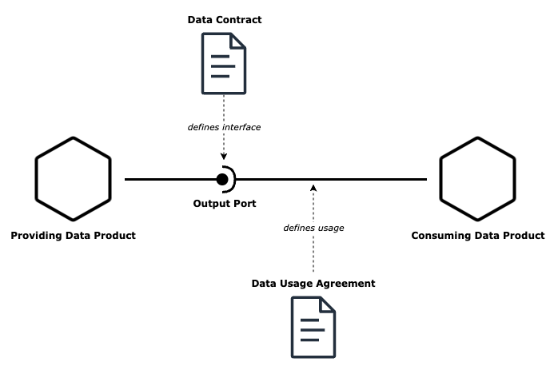

# Data Contract Specification

The Data Contract Specification is an open initiative to define a common data contract format. Think of an [OpenAPI specification](https://www.openapis.org/), but for data sets. 




A _data contract_ is a document that defines the structure, format, semantics, quality, and terms of use for exchanging data between a data provider and their consumers. A data contract is implemented by a software component, such as a data product's output port. Data contracts can also be used for the input port to specify the expectations of data dependencies.

The _data contract specification_ defines a YAML to describe attributes of provided data sets. It is data platform neutral, but supports well-known formats to express schemas (e.g., JSON Schema, dbt models, Protobuf, SQL DDL) and quality tests (e.g., SodaCL, SQL Queries) to avoid unnecessary abstractions.

Every data consumer concludes a _data usage agreement_ with the data provider referring a specific data contract version. Data usage agreements have a defined lifecycle and help the data provider to track who accesses their data and for which purposes.

Data contracts come into play when data is exchanged between different teams or organizational units, such as in a [data mesh architecture](https://www.datamesh-architecture.com/). Data contracts can serve as a foundational component of a data governance strategy. They represent a documented understanding of how data should be structured and interpreted. Data contracts are essential for ensuring data interoperability and data quality. The formal data contract can act as the basis for automation, testing, monitoring, access control, and computational governance policies. A data contract can also be used as a collaboration tool for data providers and consumers to discuss data requirements and make assumptions explicit.


_Note: The term "data contract" refers to a specification that is usually owned by the data provider and thus does not align with a "contract" in a legal sense as a mutual agreement between two parties. The term "contract" may be somewhat misleading, but it is how it is used in practice. The mutual agreement between data provider and data consumer is the "data usage agreement"._


The specification is inspired by [PayPal's Data Contract Template](https://github.com/paypal/data-contract-template/blob/main/docs/README.md) and Data Mesh Manager's [Data Contract API](https://app.datamesh-manager.com/swagger/index.html) and follows [OpenAPI](https://www.openapis.org/) and [AsyncAPI](https://www.asyncapi.com/) conventions.


Version
---

0.0.1

Example
---


```yaml
dataContractSpecification: 0.0.1
id: https://demo.datamesh-manager.com/acme/datacontracts/orders-latest-npii/1.0.0
info:
  title: Orders Latest NPII
  version: 1.0.0
  description: Successful customer orders in the webshop. All orders since 2020-01-01. Orders with their line items are in their current state (no history included). PII data is removed.
  status: proposed / active # TBD
  contact: # TBD
    name: Checkout Team
    url: https://demo.datamesh-manager.com/acme/teams/checkout
    email: checkout@example.com
provider: #TBD
  teamId: checkout
  teamName: Checkout
  dataProductId: orders
  dataProductName: Orders
  outputPortId: bigquery_orders_latest_npii_v1
  outputPortName: bigquery_orders_latest_npii_v1
servers: # TBD
  - url: jdbc:bigquery://https://www.googleapis.com/bigquery/v2:443;ProjectId=MyBigQueryProject;OAuthType=1;
    description: Production
#  production:
#    host: https://www.googleapis.com/bigquery/v2
#    project: acme_orders_prod
#    database: orders
#    dataset: bigquery_orders_latest_npii_v1
#    description: RabbitMQ broker for the production environment.
#    tags:
#      - name: "env:production"
#        description: "This environment is the live environment available for final users."
terms:
  usage: >
    Data can be used for reports, analytics and machine learning use cases.
    Order may be linked and joined by other tables
  limitations: >
    Not suitable for real-time use cases.
    Data may not be used to identify individual customers.
  quota: >
    Max data processing per day: 10 TiB
  billing: # TODO string or complex ?
    amount: 5000
    currency: USD
    unit: month  # Chrono units (month, day, second) or usage units (gigabyte, megabyte)
  noticePeriod: P3M
schema:
  type: dbt  # the specification format: dbt, bigquery, jsonschema, avro, protobuf, sql, custom
  specification:  # expressed as string or inline yaml
    version: 2 
    description: The subset of the output port's data model that we agree to use
    models:
      - name: orders
        description: >
          One record per order. Includes cancelled and deleted orders.
        columns:
          - name: order_id
            type: string
            description: Primary key of the orders table
            tests:
              - unique
              - not_null
          - name: order_timestamp
            type: timestamptz
            description: The business timestamp in UTC when the order was successfully registered in the source system and the payment was successful.
            tests:
              - not_null
          - name: order_total
            data_type: integer
            description: "Total amount of the order in the smallest monetary unit (e.g., cents)."
            tests:
              - not_null
      - name: line_items
        description: >
          The items that are part of an order
        columns:
          - name: lines_item_id
            type: string
            description: Primary key of the lines_item_id table
          - name: order_id
            type: string
            description: Foreign key to the orders table
            tests:
              - relationships:
                to: ref('orders')
                field: order_id
          - name: sku
            type: string
            description: The purchased article number
examples:  # TBD samples, sampleData, examples
  - type: csv
    model: orders
    data: |-
      order_id,order_timestamp,order_total
      "1001","2023-09-09T08:30:00Z",2500
      "1002","2023-09-08T15:45:00Z",1800
      "1003","2023-09-07T12:15:00Z",3200
      "1004","2023-09-06T19:20:00Z",1500
      "1005","2023-09-05T10:10:00Z",4200
      "1006","2023-09-04T14:55:00Z",2800
      "1007","2023-09-03T21:05:00Z",1900
      "1008","2023-09-02T17:40:00Z",3600
      "1009","2023-09-01T09:25:00Z",3100
      "1010","2023-08-31T22:50:00Z",2700
  - type: csv
    model: line_items
    data: |-
      lines_item_id,order_id,sku
      "1","1001","5901234123457"
      "2","1001","4001234567890"
      "3","1002","5901234123457"
      "4","1002","2001234567893"
      "5","1003","4001234567890"
      "6","1003","5001234567892"
      "7","1004","5901234123457"
      "8","1005","2001234567893"
      "9","1005","5001234567892"
      "10","1005","6001234567891"
quality:
  type: SodaCL   # data quality check format: SodaCL, montecarlo, dbt-tests, custom
  specification: # expressed as string or inline yaml
    checks for orders:
      - row_count > 0
      - duplicate_count(order_id) = 0
    checks for line_items:
      - row_count > 0
serviceLevelObjectives:
  freshness: < 60 seconds
  availability: 99.9%
  completeness: All orders since 2020-01-01T00:00:00Z
  performance: Full table scan < 60 seconds
tags: # TBD move to info (like in AsyncAPI)?
  - business-critical
links:
  schema: https://catalog.example.com/search/search-queries
  catalog: https://catalog.example.com/search/search-queries
custom:
  iamRole: serviceAccount:marketing-data-consumer@example-prod-data.iam.gserviceaccount.com
```

Schema
---

### Data Contract Object

This is the root document.

| Field | Type                                                                | Description                                                                     |
| ----- |---------------------------------------------------------------------|---------------------------------------------------------------------------------|
| dataContractSpecification | string                                                              | REQUIRED. Specifies the Data Contract Specification being used.                 |
| info | [Info Object](#info-object)                                         | REQUIRED. Specifies the metadata of the data contract.                          |
| provider | [Provider Object](#provider-object)                                 | REQUIRED. Specifies the data product provider                                   |
| terms | [Terms Object](#terms-object)                                       | REQUIRED. Specifies the terms and conditions of the data contract.              |
| schema | [Schema Object](#schema-object)                                     | Specifies the data contract schema. The spcification supports different schemas. |
| tags | [string]                                                            | Specifies the tags of the data contract.                                        |
| links | [Links Object](#links-object)                                       | Specifies further links of the data contract.                                   |
| custom | [Custom Object](#custom-object)                                     | Specifies custom fields of the data contract.                                   |

### Info Object

Metadata and life cycle information about the data contract.

| Field | Type                                                                | Description                                                                                                                     |
| ----- |---------------------------------------------------------------------|---------------------------------------------------------------------------------------------------------------------------------|
| id | string                                                              | REQUIRED. The unique identifier of the data contract.                                                                           |
| status | string                                                           | The status of the data contract. Typical values are:                   `draft`, `requested`, `approved`, `rejected`, `canceled` |

### Provider Object

Information about the data product provider.

| Field | Type                                                                | Description                                                                                                                                    |
| ----- |---------------------------------------------------------------------|------------------------------------------------------------------------------------------------------------------------------------------------|
| teamId | string                                                              | REQUIRED. The unique identifier of the team that provides the data product.                                                                    |
| teamName | string                                                            | The name of the team that provides the data product.                                                                                |
| dataProductId | string                                                   | REQUIRED. The unique identifier of the data product.                                                                                            |
| dataProductName | string                                                 | The name of the data product.                                                                                                                   |
| outputPortId | string                                                     | REQUIRED. The unique identifier of the output port.                                                                          |
| outputPortName | string                                                   | The name of the output port.                                                                                                                     |

### Consumer Object

Information about the data product consumer.

| Field | Type                                                                | Description                                                                 |
| ----- |---------------------------------------------------------------------|-----------------------------------------------------------------------------|
| teamId | string                                                              | REQUIRED. The unique identifier of the team that consumes the data product. |
| teamName | string                                                            | The name of the team that consumes the data product.                        |
| dataProductId | string                                                   | The unique identifier of the data product where the data is processed.      |
| dataProductName | string                                                 | The name of the data product where the data is processed.                   |


### Terms Object

The terms and conditions of the data contract.

| Field                | Type   | Description                                                                                                                                                       |
|----------------------|--------|-------------------------------------------------------------------------------------------------------------------------------------------------------------------|
| usage                | string | The usage describes the way the data is used, such as how often it is queried.                                                                                    |
| limitations          | string | The limitations describe the restrictions on how the data can be used, can be technical or restrictions on what the data may be used for.                         |
| billing              | string | The billing describes the pricing model for using the data product, such as whether it's free, having a monthly fee, or metered pay-per-use.                      |
| noticePeriod         | string | The period of time that must be given by either party to terminate or modify the contract. Uses ISO-8601 period format, e.g., `P3M` for a period of three months. |
| individualAgreements | string | Any additional individual agreements between the provider and the consumer.                                                                                       |


### Schema Object

The schema of the data contract that the provider and consumer agree to use. 
Can be a subset of the schema of the output port.
As the type of the output port depends on the data platform, multiple schema specifications are supported.

A schema may define a single table, a collection of tables as a dataset, or any arbitrary structure.

Some schema types, such as `dbt`, also support defining tests and additional metadata.

It is best practice to use a schema specification that can be directly imported to and exported from the data platform for automated data contract testing.


| Field | Type                                                                                                   | Description                                                                                                                          |
| ----- |--------------------------------------------------------------------------------------------------------|--------------------------------------------------------------------------------------------------------------------------------------|
| type | string                                                                                                 | REQUIRED. The type of the schema.<br> Typical values are: `dbt`, `bigquery`, `jsonschema`, `openapi`, `protobuf`, `paypal`, `custom` |
| specification | [dbt Schema Object](#dbt-schema-object) \| [BigQuery Schema Object](#bigquery-schema-object) \| string | REQUIRED. The specification of the schema. The schema specification can be encoded as a string or as native yaml.                    |


#### dbt Schema Object

Example:

```yaml
version: 2
models:
  - name: "My Table"
    description: "My description"
    config:
      materialized: table
    columns:
      - name: "My column"
        data_type: text
        description: "My description"
        tests:
          - dbt_expectations.expect_column_to_exist
          - not_null
```


### Links Object

Links can be added as key-value pairs.

Example:

```yaml
links:
  schema: https://schema.example.com/search/search-queries
  catalog: https://catalog.example.com/search/search-queries
```

### Custom Object

Custom information can be added as kay-value pairs.

Example:

```yaml
custom:
  iamRole: serviceAccount:marketing-data-consumer@example-prod-data.iam.gserviceaccount.com
```

Data Usage Agreement
===

| Field | Type                                                                | Description                                                                 |
| ----- |---------------------------------------------------------------------|-----------------------------------------------------------------------------|
| purpose | string                                                                                                                                        | The purpose describes the reason and the context on why the consumer wants to consume the data.                                 |
| startDate | string                                                       | The start date of the data contract. May be in the future.                                                                      |
| endDate | string                                                         | The end date of the data contract. Will be set, when a data contract is canceled.                                               |


Tooling
---
- _datacontract CLI_ (coming soon) a CLI tool to help you create, develop, and maintain your data contracts.
- [Data Mesh Manager](https://www.datamesh-manager.com/) is a commercial tool to manage data products and data contracts. It supports the data contract specification and allows the user to import or export data contracts using this specification.

License
---
[MIT License](LICENSE)
