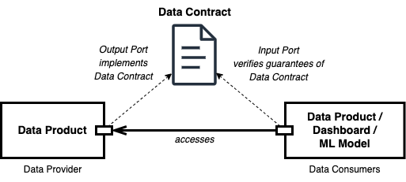

# Data Contract Specification



Data contracts bring data providers and data consumers together.

A _data contract_ is a document that defines the structure, format, semantics, quality, and terms of use for exchanging data between a data provider and their consumers. 
A data contract is implemented by a data product's output port or other data technologies. 
Data contracts can also be used for the input port to specify the expectations of data dependencies and verify given guarantees.

The _data contract specification_ defines a YAML format to describe attributes of provided data sets. 
It is data platform neutral and can be used with any data platform, such as AWS S3, Google BigQuery, Microsoft Fabric, Databricks, and Snowflake. 
The data contract specification is an open initiative to define a common data contract format. 
It follows [OpenAPI](https://www.openapis.org/) and [AsyncAPI](https://www.asyncapi.com/) conventions.

Data contracts come into play when data is exchanged between different teams or organizational units, such as in a [data mesh architecture](https://www.datamesh-architecture.com/). 
First, and foremost, data contracts are a communication tool to express a common understanding of how data should be structured and interpreted. 
They make semantic and quality expectations explicit. 
They are often created collaboratively in [workshops](/workshop) together with data providers and data consumers. 
Later in development and production, they also serve as the basis for code generation, testing, schema validations, quality checks, monitoring, access control, and computational governance policies.

The specification comes along with the [Data Contract CLI](https://github.com/datacontract/cli), an open-source tool to develop, validate, and enforce data contracts.

_Note: The term "data contract" refers to a specification that is usually owned by the data provider and thus does not align with a "contract" in a legal sense as a mutual agreement between two parties. 
The term "contract" may be somewhat misleading, but it is how it is used in practice. 
The mutual agreement between one data provider and one data consumer is the "data usage agreement" that refers to a data contract. 
Data usage agreements have a defined lifecycle, start/end date, and help the data provider to track who accesses their data and for which purposes._

Version
---

0.9.2 ([Changelog](CHANGELOG.md))

Example
---

[](https://studio.datacontract.com/)

```yaml
dataContractSpecification: 0.9.2
id: urn:datacontract:checkout:orders-latest-npii
info:
  title: Orders Latest NPII
  version: 1.0.0
  description: Successful customer orders in the webshop. All orders since 2020-01-01. Orders with their line items are in their current state (no history included). PII data is removed.
  owner: Checkout Team
  contact:
    name: John Doe (Data Product Owner)
    email: john.doe@example.com
servers:
  production:
    type: BigQuery
    project: acme_orders_prod
    dataset: bigquery_orders_latest_npii_v1
terms:
  usage: >
    Data can be used for reports, analytics and machine learning use cases.
    Order may be linked and joined by other tables
  limitations: >
    Not suitable for real-time use cases.
    Data may not be used to identify individual customers.
    Max data processing per day: 10 TiB
  billing: 5000 USD per month
  noticePeriod: P3M
models:
  orders:
    description: One record per order. Includes cancelled and deleted orders.
    type: table 
    fields:
      order_id:
        $ref: '#/definitions/order_id'
      order_timestamp:
        description: The business timestamp in UTC when the order was successfully registered in the source system and the payment was successful.
        type: timestamp
        required: true 
      order_total:
        description: Total amount the smallest monetary unit (e.g., cents).
        type: long
        required: true
      customer_id:
        description: Unique identifier for the customer.
        type: text
        minLength: 10
        maxLength: 20
      customer_email_address:
        description: The email address, as entered by the customer. The email address was not verified.
        type: text
        format: email
        required: true
  line_items:
    description: A single article that is part of an order.  
    type: table
    fields:
      lines_item_id:
        type: text
        description: Primary key of the lines_item_id table
        required: true
        unique: true
      order_id:
        $ref: '#/definitions/order_id'
      sku:
        description: The purchased article number
        $ref: '#/definitions/sku'
definitions:
  order_id:
    domain: checkout
    name: order_id
    title: Order ID
    type: text
    format: uuid
    description: An internal ID that identifies an order in the online shop.
    example: 243c25e5-a081-43a9-aeab-6d5d5b6cb5e2
    pii: true
    classification: restricted
  sku:
    domain: inventory
    name: sku
    title: Stock Keeping Unit
    type: text
    pattern: ^[A-Za-z0-9]{8,14}$
    example: 96385074
    description: |
      A Stock Keeping Unit (SKU) is an internal unique identifier for an article. 
      It is typically associated with an article's barcode, such as the EAN/GTIN.
examples:
  - type: csv # csv, json, yaml, custom
    model: orders
    data: |- # expressed as string or inline yaml or via "$ref: data.csv"
      order_id,order_timestamp,order_total
      "1001","2023-09-09T08:30:00Z",2500
      "1002","2023-09-08T15:45:00Z",1800
      "1003","2023-09-07T12:15:00Z",3200
      "1004","2023-09-06T19:20:00Z",1500
      "1005","2023-09-05T10:10:00Z",4200
      "1006","2023-09-04T14:55:00Z",2800
      "1007","2023-09-03T21:05:00Z",1900
      "1008","2023-09-02T17:40:00Z",3600
      "1009","2023-09-01T09:25:00Z",3100
      "1010","2023-08-31T22:50:00Z",2700
  - type: csv
    model: line_items
    data: |-
      lines_item_id,order_id,sku
      "1","1001","5901234123457"
      "2","1001","4001234567890"
      "3","1002","5901234123457"
      "4","1002","2001234567893"
      "5","1003","4001234567890"
      "6","1003","5001234567892"
      "7","1004","5901234123457"
      "8","1005","2001234567893"
      "9","1005","5001234567892"
      "10","1005","6001234567891"
quality:
  type: SodaCL   # data quality check format: SodaCL, montecarlo, custom
  specification: # expressed as string or inline yaml or via "$ref: checks.yaml"
    checks for orders:
      - freshness(order_timestamp) < 24h
      - row_count > 500000
      - duplicate_count(order_id) = 0
    checks for line_items:
      - row_count > 500000
```

Schema
---

- [Data Contract Object](#data-contract-object)
- [Info Object](#info-object)
- [Contact Object](#contact-object)
- [Server Object](#server-object)
- [Terms Object](#terms-object)
- [Model Object](#model-object)
- [Field Object](#field-object)
- [Definition Object](#definition-object)
- [Schema Object](#schema-object)
- [Example Object](#example-object)
- [Quality Object](#quality-object)
- [Data Types](#data-types)
- [Specification Extensions](#specification-extensions)


[JSON Schema](https://github.com/datacontract/datacontract-specification/blob/main/datacontract.schema.json) of the Data Contract Specification.

### Data Contract Object

This is the root document.

It is _RECOMMENDED_ that the root document be named: `datacontract.yaml`.

| Field                     | Type                                                 | Description                                                                                              |
|---------------------------|------------------------------------------------------|----------------------------------------------------------------------------------------------------------|
| dataContractSpecification | `string`                                             | REQUIRED. Specifies the Data Contract Specification being used.                                          |
| id                        | `string`                                             | REQUIRED. An organization-wide unique technical identifier, such as a UUID, URN, slug, string, or number |
| info                      | [Info Object](#info-object)                          | REQUIRED. Specifies the metadata of the data contract. May be used by tooling.                           |
| servers                   | Map[string, [Server Object](#server-object)]         | Specifies the servers of the data contract.                                                              |
| terms                     | [Terms Object](#terms-object)                        | Specifies the terms and conditions of the data contract.                                                 |
| models                    | Map[string, [Model Object](#model-object)]           | Specifies the logical data model.                                                                                |
| definitions               | Map[string, [Definition Object](#definition-object)] | Specifies definitions.                                                                                   |
| schema                    | [Schema Object](#schema-object)                      | Specifies the physical schema. The specification supports different schema format.                       |
| examples                  | Array of [Example Objects](#example-object)          | Specifies example data sets for the data model. The specification supports different example types.          |
| quality                   | [Quality Object](#quality-object)                    | Specifies the quality attributes and checks. The specification supports different quality check DSLs.    |

This object _MAY_ be extended with [Specification Extensions](#specification-extensions).


### Info Object

Metadata and life cycle information about the data contract.


| Field   | Type   | Description                                                                                                                                                      |
|---------|--------|------------------------------------------------------------------------------------------------------------------------------------------------------------------|
| title   | `string` | REQUIRED. The title of the data contract.                                                                                                                        |
| version | `string` | REQUIRED. The version of the data contract document (which is distinct from the Data Contract Specification version or the Data Product implementation version). |
| description | `string` | A description of the data contract.                                                                                                                              |
| owner   | `string` | The owner or team responsible for managing the data contract and providing the data.                                                                            |
| contact | [Contact Object](#contact-object) | Contact information for the data contract.                                                                                                                       |

This object _MAY_ be extended with [Specification Extensions](#specification-extensions).


### Contact Object

Contact information for the data contract.

| Field | Type     | Description                                                                                           |
|-------|----------|-------------------------------------------------------------------------------------------------------|
| name  | `string` | The identifying name of the contact person/organization.                                              |
| url   | `string` | The URL pointing to the contact information. This _MUST_ be in the form of a URL.                     |
| email | `string` | The email address of the contact person/organization. This _MUST_ be in the form of an email address. |

This object _MAY_ be extended with [Specification Extensions](#specification-extensions).

### Server Object

The fields are dependent on the defined type.

| Field       | Type     | Description                                                                                                                                                              |
|-------------|----------|--------------------------------------------------------------------------------------------------------------------------------------------------------------------------|
| type        | `string` | The type of the data product technology that implements the data contract. Well-known server types are: `bigquery`, `s3`, `redshift`, `snowflake`, `databricks`, `kafka` |
| description | `string` | An optional string describing the server.                                                                                                                                |

This object _MAY_ be extended with [Specification Extensions](#specification-extensions).

#### BigQuery Server Object

| Field   | Type     | Description |
|---------|----------|-------------|
| type    | `string` | `bigquery`  |
| project | `string` |             |
| dataset | `string` |             |

#### S3 Server Object

| Field    | Type     | Description                    |
|----------|----------|--------------------------------|
| type     | `string` | `s3`                           |
| location | `string` | S3 URL, starting with `s3://`  |

Example:

```yaml
servers:
  production:
    type: s3
    location: s3://acme-orders-prod/orders/
```


#### Redshift Server Object

| Field    | Type     | Description |
|----------|----------|-------------|
| type     | `string` | `redshift`  |
| account  | `string` |             |
| database | `string` |             |
| schema   | `string` |             |

#### Snowflake Server Object

| Field    | Type     | Description |
|----------|----------|-------------|
| type     | `string` | `snowflake` |
| account  | `string` |             |
| database | `string` |             |
| schema   | `string` |             |

#### Databricks Server Object

| Field    | Type     | Description  |
|----------|----------|--------------|
| type     | `string` | `databricks` |
| share     | `string` |              |

#### Kafka Server Object

| Field | Type     | Description |
|-------|----------|-------------|
| type  | `string` | `kafka`     |
| host  | `string` |             |
| topic | `string` |             |


### Terms Object

The terms and conditions of the data contract.

| Field                | Type   | Description                                                                                                                                                                 |
|----------------------|--------|-----------------------------------------------------------------------------------------------------------------------------------------------------------------------------|
| usage                | `string` | The usage describes the way the data is expected to be used. Can contain business and technical information.                                                                |
| limitations          | `string` | The limitations describe the restrictions on how the data can be used, can be technical or restrictions on what the data may not be used for.                               |
| billing              | `string` | The billing describes the pricing model for using the data, such as whether it's free, having a monthly fee, or metered pay-per-use.                                        |
| noticePeriod         | `string` | The period of time that must be given by either party to terminate or modify a data usage agreement. Uses ISO-8601 period format, e.g., `P3M` for a period of three months. |


### Model Object

The Model Object describes the structure and semantics of a data model, such as tables, views, or structured files.

The name of the data model (table name) is defined by the key that refers to this Model Object.

| Field       | Type                                         | Description                                                           |
|-------------|----------------------------------------------|-----------------------------------------------------------------------|
| type        | `string`                                     | The type of the model. Examples: `table`, `object`. Default: `table`. |
| description | `string`                                     | An optional string describing the data model.                         |
| fields      | Map[`string`, [Field Object](#field-object)] | The fields (e.g. columns) of the data model.                          |


### Field Object

The Field Objects describes one field (column, property, nested field) of a data model.

| Field          | Type                     | Description                                                                                                                                                                                                                                                                                                                                                                                                                  |
|----------------|--------------------------|------------------------------------------------------------------------------------------------------------------------------------------------------------------------------------------------------------------------------------------------------------------------------------------------------------------------------------------------------------------------------------------------------------------------------|
| description    | `string`                 | An optional string describing the semantic of the data in this field.                                                                                                                                                                                                                                                                                                                                                        |
| type           | [Data Type](#data-types) | The logical data type of the field.                                                                                                                                                                                                                                                                                                                                                                                          |
| required       | `boolean`                | An indication, if this field must contain a value and may not be null. Default: `false`                                                                                                                                                                                                                                                                                                                                      |
| unique         | `boolean`                | An indication, if the value must be unique within the model. Default: `false`                                                                                                                                                                                                                                                                                                                                                |
| format         | `string`                 | `email`: A value must be complaint to [RFC 5321, section 4.1.2](https://www.rfc-editor.org/info/rfc5321).<br>`uri`: A value must be complaint to [RFC 3986](https://www.rfc-editor.org/info/rfc3986).<br>`uuid`: A value must be complaint to [RFC 4122](https://www.rfc-editor.org/info/rfc4122). Only evaluated if the value is not null. Only applies to unicode character sequences types (`string`, `text`, `varchar`). |
| minLength      | `number`                 | A value must greater than, or equal to, the value of this. Only evaluated if the value is not null. Only applies to unicode character sequences types (`string`, `text`, `varchar`).                                                                                                                                                                                                                                         |
| maxLength      | `number`                 | A value must less than, or equal to, the value of this. Only evaluated if the value is not null. Only applies to unicode character sequences types (`string`, `text`, `varchar`).                                                                                                                                                                                                                                            |
| pattern        | `string`                 | A value must be valid according to the [ECMA-262](https://262.ecma-international.org/5.1/) regular expression dialect. Only evaluated if the value is not null. Only applies to unicode character sequences types (`string`, `text`, `varchar`).                                                                                                                                                                             |
| example        | `string`                 | An example value.                                                                                                                                                                                                                                                                                                                                                                                                            |
| pii            | `boolean`                | An indication, if this field contains Personal Identifiable Information (PII).                                                                                                                                                                                                                                                                                                                                               | 
| classification | `string`                 | The data class defining the sensitivity level for this field, according to the organization's classification scheme. Examples may be: `sensitive`, `restricted`, `internal`, `public`.                                                                                                                                                                                                                                       |
| tags           | Array of `string`        | Custom metadata to provide additional context.                                                                                                                                                                                                                                                                                                                                                                               |
| $ref           | `string`                 | A reference URI to a definition in the specification, internally or externally. Properties will be inherited from the definition.                                                                                                                                                                                                                                                                                            |


### Definition Object

The Definition Object includes a clear and concise explanations of syntax, semantic, and classification of a business object in a given domain.
It serves as a reference for a common understanding of terminology, ensure consistent usage and to identify join-able fields.
Models fields can refer to definitions using the `$ref` field to link to existing definitions and avoid duplicate documentations.

| Field            | Type                     | Description                                                                                                                                                                                                                                                                                                                                                                                                                  |
|------------------|--------------------------|------------------------------------------------------------------------------------------------------------------------------------------------------------------------------------------------------------------------------------------------------------------------------------------------------------------------------------------------------------------------------------------------------------------------------|
| domain           | `string`                 | The domain in which this definition is valid. Default: `global`.                                                                                                                                                                                                                                                                                                                                                             |
| name             | `string`                 | The technical name of this definition.                                                                                                                                                                                                                                                                                                                                                                                       |
| title            | `string`                 | The business name of this definition.                                                                                                                                                                                                                                                                                                                                                                                        |
| description      | `string`                 | Clear and concise explanations related to the domain                                                                                                                                                                                                                                                                                                                                                                         |
| type             | [Data Type](#data-types) | The logical data type                                                                                                                                                                                                                                                                                                                                                                                                        |
| required         | `boolean`                | An indication, if this field must contain a value and may not be null. Default: `false`                                                                                                                                                                                                                                                                                                                                      |
| unique           | `boolean`                | An indication, if the value must be unique within the model. Default: `false`                                                                                                                                                                                                                                                                                                                                                |
| enum             | array of `string`        | A value must be equal to one of the elements in this array value. Only evaluated if the value is not null.                                                                                                                                                                                                                                                                                                                   |
| format           | `string`                 | `email`: A value must be complaint to [RFC 5321, section 4.1.2](https://www.rfc-editor.org/info/rfc5321).<br>`uri`: A value must be complaint to [RFC 3986](https://www.rfc-editor.org/info/rfc3986).<br>`uuid`: A value must be complaint to [RFC 4122](https://www.rfc-editor.org/info/rfc4122). Only evaluated if the value is not null. Only applies to unicode character sequences types (`string`, `text`, `varchar`). |
| minLength        | `number`                 | A value must greater than, or equal to, the value of this. Only evaluated if the value is not null. Only applies to unicode character sequences types (`string`, `text`, `varchar`).                                                                                                                                                                                                                                         |
| maxLength        | `number`                 | A value must less than, or equal to, the value of this. Only evaluated if the value is not null. Only applies to unicode character sequences types (`string`, `text`, `varchar`).                                                                                                                                                                                                                                            |
| pattern          | `string`                 | A value must be valid according to the [ECMA-262](https://262.ecma-international.org/5.1/) regular expression dialect. Only evaluated if the value is not null. Only applies to unicode character sequences types (`string`, `text`, `varchar`).                                                                                                                                                                             |
| minimum          | `number`                 | A value of a number must greater than, or equal to, the value of this. Only evaluated if the value is not null. Only applies to numeric values.                                                                                                                                                                                                                                                                              |
| exclusiveMinimum | `number`                 | A value of a number must greater than the value of this. Only evaluated if the value is not null. Only applies to numeric values.                                                                                                                                                                                                                                                                                            |
| maximum          | `number`                 | A value of a number must less than, or equal to, the value of this. Only evaluated if the value is not null. Only applies to numeric values.                                                                                                                                                                                                                                                                                 |
| exclusiveMaximum | `number`                 | A value of a number must less than the value of this. Only evaluated if the value is not null. Only applies to numeric values.                                                                                                                                                                                                                                                                                               |
| example          | `string`                 | An example value.                                                                                                                                                                                                                                                                                                                                                                                                            |
| pii              | `boolean`                | An indication, if this field contains Personal Identifiable Information (PII).                                                                                                                                                                                                                                                                                                                                               |
| classification   | `string`                 | The data class defining the sensitivity level for this field, according to the organization's classification scheme.                                                                                                                                                                                                                                                                                                         |
| tags             | Array of `string`        | Custom metadata to provide additional context.                                                                                                                                                                                                                                                                                                                                                                               |


### Schema Object

The schema of the data contract describes the physical schema. 
The type of the schema depends on the data platform.

| Field | Type                                                                                                                                                                                                                 | Description                                                                                                                         |
| ----- |----------------------------------------------------------------------------------------------------------------------------------------------------------------------------------------------------------------------|-------------------------------------------------------------------------------------------------------------------------------------|
| type | `string`                                                                                                                                                                                                               | REQUIRED. The type of the schema.<br> Typical values are: `dbt`, `bigquery`, `json-schema`, `sql-ddl`, `avro`, `protobuf`, `custom` |
| specification | [dbt Schema Object](#dbt-schema-object) \|<br> [BigQuery Schema Object](#bigquery-schema-object) \|<br> [JSON Schema Schema Object](#bigquery-schema-object) \|<br> [SQL DDL Schema Object](#sql-ddl-schema-object) \|<br> `string` | REQUIRED. The specification of the schema. The schema specification can be encoded as a string or as inline YAML.                  |


#### dbt Schema Object

https://docs.getdbt.com/reference/model-properties

Example (inline YAML):

```yaml
schema:
  type: dbt
  specification:
    version: 2
    models:
      - name: "My Table"
        description: "My description"
        columns:
          - name: "My column"
            data_type: text
            description: "My description"
```

Example (string):

```yaml
schema:
  type: dbt
  specification: |-
    version: 2
    models:
      - name: "My Table"
        description: "My description"
        columns:
          - name: "My column"
            data_type: text
            description: "My description"
```

#### BigQuery Schema Object

The schema structure is defined by the [Google BigQuery Table](https://cloud.google.com/bigquery/docs/reference/rest/v2/tables#resource:-table) object. You can extract such a Table object via the [tables.get](https://cloud.google.com/bigquery/docs/reference/rest/v2/tables/get) endpoint.

Instead of providing a single Table object, you can also provide an array of such objects. Be aware that [tables.list](https://cloud.google.com/bigquery/docs/reference/rest/v2/tables/list) only returns a subset of the full Table object. You need to call every Table object via [tables.get](https://cloud.google.com/bigquery/docs/reference/rest/v2/tables/get) to get the full Table object, including the actual schema.

Learn more: [Google BigQuery REST Reference v2](https://cloud.google.com/bigquery/docs/reference/rest)


Example:

```yaml
schema:
  type: bigquery
  specification: |-
    {
      "tableReference": {
        "projectId": "my-project",
        "datasetId": "my_dataset",
        "tableId": "my_table"
      },
      "description": "This is a description",
      "type": "TABLE",
      "schema": {
        "fields": [
          {
            "name": "name",
            "type": "STRING",
            "mode": "NULLABLE",
            "description": "This is a description"
          }
        ]
      }
    }
```

#### JSON Schema Schema Object

JSON Schema can be defined as JSON or rendered as YAML, following the [OpenAPI Schema Object dialect](https://spec.openapis.org/oas/v3.1.0#properties)

Example (inline YAML):

```yaml
schema:
  type: json-schema
  specification:
    orders:
      description: One record per order. Includes cancelled and deleted orders.
      type: object
      properties:
        order_id:
          type: string
          description: Primary key of the orders table
        order_timestamp:
          type: string
          format: date-time
          description: The business timestamp in UTC when the order was successfully registered in the source system and the payment was successful.
        order_total:
          type: integer
          description: Total amount of the order in the smallest monetary unit (e.g., cents).
    line_items:
      type: object
      properties:
        lines_item_id:
          type: string
          description: Primary key of the lines_item_id table
        order_id:
          type: string
          description: Foreign key to the orders table
        sku:
          type: string
          description: The purchased article number
```

Example (string):

```yaml
schema:
  type: json-schema
  specification: |-
    {
      "$schema": "http://json-schema.org/draft-07/schema#",
      "type": "object",
      "properties": {
        "orders": {
          "type": "object",
          "description": "One record per order. Includes cancelled and deleted orders.",
          "properties": {
            "order_id": {
              "type": "string",
              "description": "Primary key of the orders table"
            },
            "order_timestamp": {
              "type": "string",
              "format": "date-time",
              "description": "The business timestamp in UTC when the order was successfully registered in the source system and the payment was successful."
            },
            "order_total": {
              "type": "integer",
              "description": "Total amount of the order in the smallest monetary unit (e.g., cents)."
            }
          },
          "required": ["order_id", "order_timestamp", "order_total"]
        },
        "line_items": {
          "type": "object",
          "properties": {
            "lines_item_id": {
              "type": "string",
              "description": "Primary key of the lines_item_id table"
            },
            "order_id": {
              "type": "string",
              "description": "Foreign key to the orders table"
            },
            "sku": {
              "type": "string",
              "description": "The purchased article number"
            }
          },
          "required": ["lines_item_id", "order_id", "sku"]
        }
      },
      "required": ["orders", "line_items"]
    }
```

#### SQL DDL Schema Object

Classical SQL DDLs can be used to describe the structure.


Example (string):

```yaml
schema:
  type: sql-ddl
  specification: |-
      -- One record per order. Includes cancelled and deleted orders.
      CREATE TABLE orders (
        order_id TEXT PRIMARY KEY, -- Primary key of the orders table
        order_timestamp TIMESTAMPTZ NOT NULL, -- The business timestamp in UTC when the order was successfully registered in the source system and the payment was successful.
        order_total INTEGER NOT NULL -- Total amount of the order in the smallest monetary unit (e.g., cents)
      );
    
      -- The items that are part of an order
      CREATE TABLE line_items (
        lines_item_id TEXT PRIMARY KEY, -- Primary key of the lines_item_id table
        order_id TEXT REFERENCES orders(order_id), -- Foreign key to the orders table
        sku TEXT NOT NULL -- The purchased article number
      );

```

### Example Object

| Field       | Type     | Description                                                                                                                             |
|-------------|----------|-----------------------------------------------------------------------------------------------------------------------------------------|
| type        | `string` | The type of the data product technology that implements the data contract. Well-known server types are: `csv`, `json`, `yaml`, `custom` |
| description | `string` | An optional string describing the example.                                                                                              |
| model       | `string` | The reference to the model in the schema, e.g. a table name.                                                                            |                                                                                        
| data        | `string` | Example data for this model.                                                                                                            |

Example:

```yaml
examples:
- type: csv
  model: orders
  data: |-
    order_id,order_timestamp,order_total
    "1001","2023-09-09T08:30:00Z",2500
    "1002","2023-09-08T15:45:00Z",1800
    "1003","2023-09-07T12:15:00Z",3200
    "1004","2023-09-06T19:20:00Z",1500
    "1005","2023-09-05T10:10:00Z",4200
    "1006","2023-09-04T14:55:00Z",2800
    "1007","2023-09-03T21:05:00Z",1900
    "1008","2023-09-02T17:40:00Z",3600
    "1009","2023-09-01T09:25:00Z",3100
    "1010","2023-08-31T22:50:00Z",2700
```

### Quality Object

The quality object contains quality attributes and checks.

| Field | Type                                                                                                                          | Description                                                                                                                     |
| ----- |-------------------------------------------------------------------------------------------------------------------------------|---------------------------------------------------------------------------------------------------------------------------------|
| type | `string`                                                                                                                        | REQUIRED. The type of the schema.<br> Typical values are: `SodaCL`, `montecarlo`, `custom`                                      |
| specification | [SodaCL Quality Object](#sodacl-quality-object) \|<br> [Monte Carlo Schema Object](#monte-carlo-quality-object) \|<br> `string` | REQUIRED. The specification of the quality attributes. The quality specification can be encoded as a string or as inline YAML.  |


#### SodaCL Quality Object

Quality attributes in [Soda Checks Language](https://docs.soda.io/soda-cl/soda-cl-overview.html).

The `specification` represents the content of a `checks.yml` file.

Example (inline):

```yaml
quality:
  type: SodaCL   # data quality check format: SodaCL, montecarlo, dbt-tests, custom
  specification: # expressed as string or inline yaml or via "$ref: checks.yaml"
    checks for orders:
      - row_count > 0
      - duplicate_count(order_id) = 0
    checks for line_items:
      - row_count > 0
```

Example (string):

```yaml
quality:
  type: SodaCL
  specification: |-
    checks for search_queries:
      - freshness(search_timestamp) < 1d
      - row_count > 100000
      - missing_count(search_query) = 0
```

#### Monte Carlo Quality Object

Quality attributes defined as Monte Carlos [Monitors as Code](https://docs.getmontecarlo.com/docs/monitors-as-code).

The `specification` represents the content of a `montecarlo.yml` file.

Example (string):

```yaml
quality:
  type: montecarlo
  specification: |-
    montecarlo:
      field_health:
        - table: project:dataset.table_name
          timestamp_field: created
      dimension_tracking:
        - table: project:dataset.table_name
          timestamp_field: created
          field: order_status
```

### Data Types

The following data types are supported for model fields and definitions:

- Unicode character sequence: `string`, `text`, `varchar`
- Any numeric type, either integers or floating point numbers: `number`, `decimal`, `numeric`
- 32-bit signed integer: `int`, `integer`
- 64-bit signed integer: `long`, `bigint`
- Single precision (32-bit) IEEE 754 floating-point number: `float`
- Double precision (64-bit) IEEE 754 floating-point number: `double`
- Binary value: `boolean`
- Timestamp with timezone: `timestamp`, `timestamp_tz`
- Timestamp with no timezone: `timestamp_ntz`
- Date with no time information: `date`
- Array: `array`
- Sequence of 8-bit unsigned bytes: `bytes`
- Complex type: `object`, `record`, `struct`
- No value: `null`

### Specification Extensions

While the Data Contract Specification tries to accommodate most use cases, additional data can be added to extend the specification at certain points.

A custom fields can be added with any name. The value can be null, a primitive, an array or an object. 

### Design Principles

The Data Contract Specification follows these design principles:

- A free, open, and open-sourced standard
- Follow OpenAPI and AsyncAPI conventions so that it feels immediately familiar 
- Support contract-first approaches
- Support code-first approaches
- Support tooling by being machine-readable

Tooling
---
- [Data Contract CLI](https://github.com/datacontract/cli) is a free CLI tool to help you create, develop, and maintain your data contracts.
- [Data Contract Studio](https://studio.datacontract.com/) is a free web tool to develop and share data contracts.
- [Data Mesh Manager](https://www.datamesh-manager.com/) is a commercial tool to manage data products and data contracts. It supports the data contract specification and allows the user to import or export data contracts using this specification.


Other Data Contract Specifications
---
- [AIDA User Group's Open Data Contract Standard](https://github.com/AIDAUserGroup/open-data-contract-standard)
- [PayPal's Data Contract Template](https://github.com/paypal/data-contract-template/blob/main/docs/README.md)

Literature
---
- [Driving Data Quality with Data Contracts](https://www.amazon.com/dp/B0C37FPH3D) by Andrew Jones

Authors
---
The Data Contract Specification was originally created by [Jochen Christ](https://www.linkedin.com/in/jochenchrist/) and [Dr. Simon Harrer](https://www.linkedin.com/in/simonharrer/), and is currently maintained by them.


Contributing
---
Contributions are welcome! Please open an issue or a pull request.

License
---
[MIT License](LICENSE)


<a href="https://github.com/datacontract/datacontract-specification/" class="github-corner" aria-label="View source on GitHub"><svg width="80" height="80" viewBox="0 0 250 250" style="fill:#151513; color:#fff; position: absolute; top: 0; border: 0; right: 0;" aria-hidden="true"><path d="M0,0 L115,115 L130,115 L142,142 L250,250 L250,0 Z"></path><path d="M128.3,109.0 C113.8,99.7 119.0,89.6 119.0,89.6 C122.0,82.7 120.5,78.6 120.5,78.6 C119.2,72.0 123.4,76.3 123.4,76.3 C127.3,80.9 125.5,87.3 125.5,87.3 C122.9,97.6 130.6,101.9 134.4,103.2" fill="currentColor" style="transform-origin: 130px 106px;" class="octo-arm"></path><path d="M115.0,115.0 C114.9,115.1 118.7,116.5 119.8,115.4 L133.7,101.6 C136.9,99.2 139.9,98.4 142.2,98.6 C133.8,88.0 127.5,74.4 143.8,58.0 C148.5,53.4 154.0,51.2 159.7,51.0 C160.3,49.4 163.2,43.6 171.4,40.1 C171.4,40.1 176.1,42.5 178.8,56.2 C183.1,58.6 187.2,61.8 190.9,65.4 C194.5,69.0 197.7,73.2 200.1,77.6 C213.8,80.2 216.3,84.9 216.3,84.9 C212.7,93.1 206.9,96.0 205.4,96.6 C205.1,102.4 203.0,107.8 198.3,112.5 C181.9,128.9 168.3,122.5 157.7,114.1 C157.9,116.9 156.7,120.9 152.7,124.9 L141.0,136.5 C139.8,137.7 141.6,141.9 141.8,141.8 Z" fill="currentColor" class="octo-body"></path></svg></a><style>.github-corner:hover .octo-arm{animation:octocat-wave 560ms ease-in-out}@keyframes octocat-wave{0%,100%{transform:rotate(0)}20%,60%{transform:rotate(-25deg)}40%,80%{transform:rotate(10deg)}}@media (max-width:500px){.github-corner:hover .octo-arm{animation:none}.github-corner .octo-arm{animation:octocat-wave 560ms ease-in-out}}</style>
